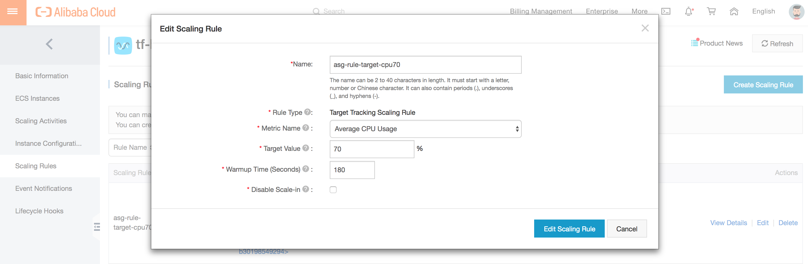
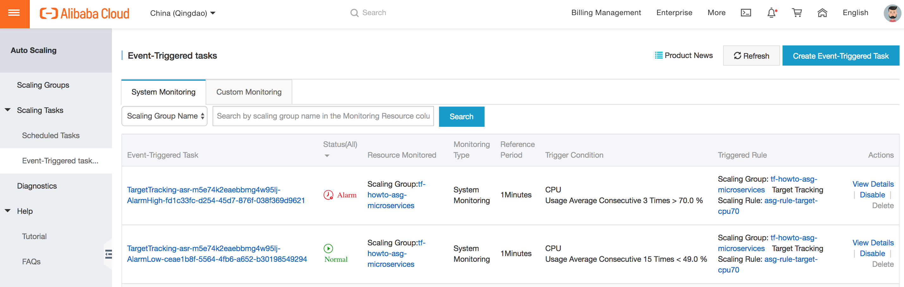
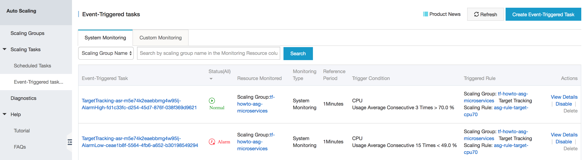

# How-to create a microservice on Alibaba Cloud

## Summary

1. [Introduction](#introduction)
2. [Prerequisite](#prerequisite)
3. [Step 1-1 - Create a front-end web application](#step-1-1---create-a-front-end-web-application)
4. [Step 1-2 - deploy a front-end web application](#step-1-2---deploy-a-front-end-web-application)
5. [Step 1-3 - Configure domain name and CDN](#step-1-3---configure-domain-name-and-cdn)
6. [Step 2-1 - Create a back-end web application](#step-2-1---create-a-back-end-web-application)
7. [Step 2-2 - Deploy a back-end web application](#step-2-2---deploy-a-back-end-web-application)
8. [Step 2-3 - Update a front-end web application server](#step-2-3---update-a-front-end-web-application-server)
9. [Step 3-1 - Create a database](#step-3-1---create-a-database)
10. [Step 3-2 - Create a database API application](#step-3-2---create-a-database-api-application)
11. [Step 3-3 - Deploy a database API application](#step-3-3---deploy-a-database-api-application)
12. [Step 3-4 - Update a back-end web API application server](#step-3-4---update-a-back-end-web-api-application-server)
13. [Step 4-1 - Create a load balancer](#step-4-1---create-a-load-balancer)
14. [Step 4-2 - Configure auto scaling](#step-4-2---configure-auto-scaling)
15. [Step 4-3 - Update back-end web application servers](#step-4-3---update-back-end-web-application-servers)
16. [Step 4-4 After all](#step-4-4-after-all)
16. [Support](#support)


## Introduction

The goal of this tutorial is to explain how to create a microservice on Alibaba Cloud. [Microservices](https://microservices.io/) is a widely used architectural style that structures an application as a collection of services. It has benefit such as selection of appropriete technology, efficient deployment, or simplification of scaling, for each service.

This tutorial will introduce a classical architecture of microservices which uses Alibaba Cloud core services such as VPC, ECS, RDS, SLB, OSS, or CDN. After finishing this turorial, you can know how to use these cloud services. Through this tutorial, we will create a small microservice step by step. It contains samples for front-end web application, back-end web application, database API application, and infrastructure code so that you can know how to create, deploy or update applications on the cloud services too.

This tutorial focuses on constructing a microservice. If you are more interested in DevOps such as CI/CD, you can refer [Alibaba Cloud DevOps tutorials](https://github.com/alibabacloud-howto/devops).

You can find more How-to documents in our [Github](https://github.com/alibabacloud-howto).


## Prerequisite

### Alibaba Cloud

Before starting this tutorial, you need to prepare the following things.

1. An Alibaba Cloud account

    You need an Alibaba Cloud account. If you don't have any account, please follow
    [this document to create one](https://www.alibabacloud.com/help/doc-detail/50482.htm).

2. An access key of an Alibaba Cloud accound

    You need an accessKeyId and an accessKeySecret to create your Alibaba Cloud products by Terraform. Please follow
    [this document to obtain an access key id and secret](https://www.alibabacloud.com/help/faq-detail/63482.htm).


### Local environment

* [Terraform](https://www.terraform.io/)

We will use Terraform in this tutorial many times. It is a powerful tool of Infrastructure as code made by HashCorp. It can automate constructing cloud infrastructure. Please install it if you don't have.

It enables us to create cloud resources effectively. Also, it enables us to manage the cloud infrastructure with files. Terraform configuration files contain the information of cloud resources and the architecture, and also Terraform saves the state of cloud resources in files after it applys changes.

## Step 1-1 - Create a front-end web application

We will deploy a front-end web applicaiont on cloud. First of all, let's create a simple front-end web application and check it works on local.

### Prepare local environment

* [Vue.js](https://vuejs.org/index.html)

In this tutorial, we create a front-end application with Vue.js. Vue.js is a javascript web framework, which is light weight, high readable, and easy to customize.

To run Vue.js, you have to install Node.js and npm on your local machine. Please install them if you don't have. When you install Node.js, npm is also installed at the same time.

* [Node.js](https://nodejs.org/)
* [npm](https://github.com/npm/cli)

You can check your environment with the following commands in a terminal:

```bash
# Check that Node.js is installed
node -v

# Check that npm is installed
npm -v
```

This tutorial is checked with the following enviroinment:

```md
* macOS High Sierra: 10.13.4
* node: v10.15.3
* npm: 6.4.1
* vue: 3.5.5 (will be installed in the later part by vue-cli)
```

### Create a front-end web application

1. Prepare a working directory

    First, change your working directory for this tutorial. For example, "~/Desktop/alibaba/howto/microservices/".

    ```sh
    cd /<path>/<to>/<your>/<working>/<directory>/
    ```

    Second, create directories for the front-end web application and change to the directory by following commands in a terminal:

    ```sh
    mkdir -p front/app/
    cd front/app/
    ```

2. Create a vue app

    Then, run the following commands to install [Vue CLI](https://cli.vuejs.org/guide/creating-a-project.html#vue-create) and create a new front-end application named *front-app*. Vue CLI enables us to create a new Vuejs project quickly.

    ```sh
    npm init -yes
    npm i -D vue-cli
    vue create front-app --default
    ```

    The result should be like this:

    ```txt
    ...

    🎉  Successfully created project front-app.
    👉  Get started with the following commands:

    $ cd front-app
    $ npm run serve
    ```

3. Verify the application works

    Finally, you can run the local server to check it works.

    Run the follwing command:

    ```sh
    cd front-app/
    npm run serve
    ```

    The result of the commnad must be like this:

    ```txt
    ...

    DONE  Compiled successfully in 3465ms                                                     9:14:35 PM

      App running at:
      - Local:   http://localhost:8080/
      - Network: unavailable

      Note that the development build is not optimized.
      To create a production build, run npm run build.
    ```

    access to your website at http://localhost:8080 on your browser.

    After you confirm it works, stop the local server by ctrl+c in a termial.

Now, you completed to prepare a simple web application! We will deploy it on cloud in the next step.


## Step 1-2 - Deploy a front-end web application

Let's deploy the front-end web application which we created in the previous step. We will deploy it on [Object Storage Service (OSS)](https://www.alibabacloud.com/help/doc-detail/31817.htm), which is cloud storage service in Alibaba Cloud. Usually, OSS is used to store static files such as images, videos, log files, or backup files. However, we use OSS as host by using the feature [static website hosting](https://www.alibabacloud.com/help/doc-detail/31872.htm) this time. It enable us to host a website easily, and the big benefit of static website hosting is that you don't have to care any server operation or management to host the website. We can access our website hosted on cloud after finishing this step.

### Prepare local environment

In this step, we will use Terraform to create a new OSS bucket.

### Create a OSS bucket

1. Prepare the working directory

    First, change the working directory.

    ```sh
    cd ../../../  # it should be same as /<path>/<to>/<your>/<working>/<directory>/

    mkdir -p front/infrastructure/
    cd front/infrastructure/
    ```

2. Create a Terraform variable file

    Second, prepare a variable definition file named *terraform.tfvars*, which will be loaded from Terraform main script.

    Create the file,

    ```sh
    touch terraform.tfvars
    ```

    copy the following content into the file,

    `terraform.tfvars`
    ```sh
    # The access key id of the Alibaba Cloud account
    access_key = "xxxxxxxxxxxxxxxx"
    # The access key secret of the Alibaba Cloud account
    secret_key = "xxxxxxxxxxxxxxxxxxxxxxxxxxxxxx"
    # Region in Alibaba Cloud
    region = "cn-qingdao"
    # Prefix for the name of the cloud resource
    prefix = "tf-howto-"
    # Suffix for the name of the cloud resource
    suffix = "-microservices"
    ```

    and change *access_key* and *secret_key* to yours accordingly. You can change *region* if you want. Please note that OSS bucket name must not be same as any existing one in the world, hence you have to change *prefix* or *suffix*, which can be changed whatever you want such as date or your name.

3. Create a Terraform script (OSS)

    Third, create a Terraform script.

    ```sh
    touch main.tf
    ```

    and copy the following content into the file.

    `main.tf`
    ```sh
    # Variables
    variable "access_key" {}
    variable "secret_key" {}
    variable "region" {}
    variable "prefix" {}
    variable "suffix" {}


    # Provider
    provider "alicloud" {
        access_key = "${var.access_key}"
        secret_key = "${var.secret_key}"
        region = "${var.region}"
    }

    # OSS
    resource "alicloud_oss_bucket" "oss" {
        bucket = "${var.prefix}oss${var.suffix}"
        acl = "private"

        website = {
            index_document = "index.html"
        }
    }


    # Output
    output "[output] oss id" {
        value = "${alicloud_oss_bucket.oss.id}"
    }
    output "[output] oss extranet_endpoint" {
        value = "${alicloud_oss_bucket.oss.extranet_endpoint}"
    }
    ```

    It describes we use Alibaba Cloud as cloud provider, use a OSS bucket with configuration of static website hosting, and print out some OSS bucket information to the terminal after the script execution is completed.

4. Initialize Terraform

    Run the following command:

    ```sh
    terraform init
    ```

    The result should be like this:

    ```txt
    ...

    * provider.alicloud: version = "~> 1.45"

    Terraform has been successfully initialized!

    You may now begin working with Terraform. Try running "terraform plan" to see
    any changes that are required for your infrastructure. All Terraform commands
    should now work.

    If you ever set or change modules or backend configuration for Terraform,
    rerun this command to reinitialize your working directory. If you forget, other
    commands will detect it and remind you to do so if necessary.
    ```

    It is needed only once after you created a new Terraform configuration. It may take a few minutes.

5. Verify the Terraform script (OSS)

    Run the following command to verify the script:

    ```sh
    terraform plan
    ```

    You can check what will happen before you apply the script. The result should be like this:

    ```txt
    ...

    ------------------------------------------------------------------------

    An execution plan has been generated and is shown below.
    Resource actions are indicated with the following symbols:
      + create

    Terraform will perform the following actions:

      + alicloud_oss_bucket.oss
          id:                       <computed>
    ...
          owner:                    <computed>
          storage_class:            "Standard"
          website.#:                "1"
          website.0.index_document: "index.html"


    Plan: 1 to add, 0 to change, 0 to destroy.

    ------------------------------------------------------------------------
    ...
    ```

6. Apply the Terraform script (OSS)

    Run the following command:

    ```sh
    terraform apply
    ```

    and type **yes** to construct the infrastructure on cloud. The result should be like this:

    ```txt
    ...

    Do you want to perform these actions?
      Terraform will perform the actions described above.
      Only 'yes' will be accepted to approve.

      Enter a value: yes

    alicloud_oss_bucket.oss: Creating...
    ...
      storage_class:            "" => "Standard"
      website.#:                "" => "1"
      website.0.index_document: "" => "index.html"
    alicloud_oss_bucket.oss: Creation complete after 3s (ID: tf-howo-oss-microservices)

    Apply complete! Resources: 1 added, 0 changed, 0 destroyed.

    Outputs:

    [output] oss id = tf-howto-oss-microservices
    [output] oss extranet_endpoint = oss-cn-qingdao.aliyuncs.com
    ```

    After it finished, you can see the OSS bucket you created in [Alibaba Cloud OSS web console](https://oss.console.aliyun.com/bucket).

### Deploy your front-end application

You have prepared the infrastructure. So, let's deploy the application on cloud.

1. Build your front-end application

    Run the following commands:

    ```sh
    cd ../../  # it should be same as /<path>/<to>/<your>/<working>/<directory>/
    cd front/app/front-app/
    npm run build
    ls dist/
    ```

    Check the *dist/* directory. It must contain files such as *index.html* or bundled javascript file.

2. Deploy your front-end application to OSS

    Upload the files in *dist/* directory to your OSS bucket. Instead we do it from OSS web console, we use [ossutil](https://www.alibabacloud.com/help/doc-detail/50452.htm) to do it in a terminal. Ossutil is a tool in Alibaba Cloud to manage OSS data.

    1. Change directory

        Run the following commands:

        ```sh
        cd ../../../  # it should be same as /<path>/<to>/<your>/<working>/<directory>/
        mkdir -p front/tool/oss/
        cd front/tool/oss/
        ```

    2. Download ossutil

        You can download ossutil from [here](https://www.alibabacloud.com/help/doc-detail/50452.htm). The following command is an example to get the tool in a terminal for MacOS.

        ```sh
        curl -O http://gosspublic.alicdn.com/ossutil/1.6.0/ossutilmac64
        chmod 755 ossutilmac64
        ```

    3.  Deploy the application by ossutil

        1. Check the Endpoint of OSS bucket

            You can check the endpoint from your previous Terraform output. Or, from [Alibaba Cloud OSSweb console](https://oss.console.aliyun.com/bucket), select your OSS bucket from the list at left, then you can check *Endpoint* for **Internet Access** in your OSS bucket page. It must be like "oss-cn-qingdao.aliyuncs.com".

        2. Configure the tool

            Run the following commands to configure the tool. Please input *OSSUTIL_ACCESS_KEY_ID*, *OSSUTIL_ACCESS_KEY_SECRET*, and *OSSUTIL_ENDPOINT* with yours. The following commands is an example with tool for MacOS.

            ```sh
            export OSSUTIL_ACCESS_KEY_ID=xxxxxxxxxxxxxxxx
            export OSSUTIL_ACCESS_KEY_SECRET=xxxxxxxxxxxxxxxxxxxxxxxxxxxxxx
            export OSSUTIL_ENDPOINT=oss-cn-qingdao.aliyuncs.com
            ./ossutilmac64 config --access-key-id=$OSSUTIL_ACCESS_KEY_ID --access-key-secret=$OSSUTIL_ACCESS_KEY_SECRET --endpoint=$OSSUTIL_ENDPOINT
            mv ~/.ossutilconfig .
            ```

            By default, ossutil config file will be created in home directory. We move the file to the current directory to keep our home directory clean.

        3. Deploy

            Run the following commands to upload the files in *dist/* directory to your OSS bucket. The following command is an example with tool for MacOS. Please input *OSSUTIL_OSS_BUCKET_NAME* with yours.

            ```sh
            export OSSUTIL_OSS_BUCKET_NAME=tf-howto-oss-microservices
            ./ossutilmac64 --config-file="`pwd`/.ossutilconfig" cp -r ../../app/front-app/dist/ oss://$OSSUTIL_OSS_BUCKET_NAME/ --acl=public-read
            ```

            Now, you can see the font-end application files in your OSS bucket.

### Verify the static website hosting works

1. Check the Bucket Domain Name

    In [Alibaba Cloud OSSweb console](https://oss.console.aliyun.com/bucket), select your OSS bucket from the list at left, then check *Bucket Domain Name* for **Internet Access** in your OSS bucket page. It must be like "tf-howo-oss-microservices.oss-cn-qingdao.aliyuncs.com".

2. Access your website.

    Access your website on your browser with your *Bucket Domain Name* for **Internet Access**.

Now, you completed to host a website with your web application on cloud!


## Step 1-3 - Configure domain name and CDN

We hosted a website in the previous step, but the domain name is still the one provided by OSS automatically and it's quite strange as public website domain. In this step, we will assign own domain name to the website and also accelerate it with content delivery network service.

We will use some cloud services. One is [Domain name](https://www.alibabacloud.com/help/doc-detail/61257.htm), which is a domain name management service in Alibaba Cloud. One is [Alibaba Cloud DNS](https://www.alibabacloud.com/help/doc-detail/58165.htm), which is a DNS management service in Alibaba Cloud. And other one is [Alibaba Cloud CDN](https://www.alibabacloud.com/help/product/27099.htm), which is a content delivery network service in Alibaba Cloud.

If you don't need to change the domain name or accelerate your website, you can skip this step.

### Register a domain in Alibaba Cloud

At first, you have to register domain name in Alibaba Cloud to apply it to your website. If you don't have any domain name, please follow [this document to obtain new domain](https://www.alibabacloud.com/help/doc-detail/54068.htm). If you already have some domain name, please follow [this document to register your domain](https://www.alibabacloud.com/help/doc-detail/58153.htm).

You can check domain name list you registered in Alibaba Cloud from [Domainweb console](https://dc.console.aliyun.com/next/index#/domain/list/all-domain).

### Configure DNS and CDN

Let's create a DNS record and confugure CDN.

1. Change the working directory

    First, change the working directory.

    ```sh
    cd ../../../  # it should be same as /<path>/<to>/<your>/<working>/<directory>/

    cd front/infrastructure/
    ```

2. Update the Terraform variable file

    Second, add your domain name to the variable definition file *terraform.tfvars* like this:

    `terraform.tfvars`
    ```sh
    ...

    # Domain name of the website
    domain = "example.com"
    # Subdomain name of the website
    subdomain = "howto.microservices.yyyyy"
    ```

    Please change them to yours accordingly.

3. Update the Terraform script

    Third, add configuration about DNS and CDN into the Terraform script.

    `main.tf`
    ```sh
    # Variables
    variable "access_key" {}
    variable "secret_key" {}
    variable "region" {}
    variable "prefix" {}
    variable "suffix" {}
    variable "domain" {}  # ADDED
    variable "subdomain" {}  # ADDED

    # Provider
    ...

    # OSS
    ...

    # CDN
    resource "alicloud_cdn_domain_new" "domain" {
      domain_name = "${var.subdomain}.${var.domain}"
      cdn_type = "web"
      scope = "overseas"  # domestic, overseas, global.
      sources {
          content = "${alicloud_oss_bucket.oss.id}.${alicloud_oss_bucket.oss.extranet_endpoint}"
          type = "oss"
          port = 80
      }
    }

    # DNS record
    resource "alicloud_dns_record" "record" {
      name = "${var.domain}"
      host_record = "${var.subdomain}"
      type = "CNAME"
      value = "${alicloud_cdn_domain_new.domain.domain_name}.w.kunlunsl.com"
    }


    # Output
    ...
    output "[output] cdn domain_name" {
      value = "${alicloud_cdn_domain_new.domain.domain_name}"
    }
    ```

    It describes we use CDN with your domain name as front side and the Internet domain name of OSS bucket as back side, use Alibaba Cloud DNS to add CNAME record in order to resolve the relation between alias of CDN domain and OSS domain name.

    If you want to configure CDN scope area to the one which includes China, you have to apply for [ICP filing](https://www.alibabacloud.com/icp).

4. Verify the Terraform script

    Run the following command:

    ```sh
    terraform plan
    ```

    The result should be like this:

    ```txt
    ...

    ------------------------------------------------------------------------

    An execution plan has been generated and is shown below.
    Resource actions are indicated with the following symbols:
      + create

    Terraform will perform the following actions:

      + alicloud_cdn_domain_new.domain
          id:                 <computed>
          cdn_type:           "web"
    ...

      + alicloud_dns_record.record
          id:                 <computed>
    ...

    Plan: 2 to add, 0 to change, 0 to destroy.

    ------------------------------------------------------------------------
    ...
    ```

5. Apply the Terraform script

    Run the following command:

    ```sh
    terraform apply
    ```

    and type **yes**. It may take a few minutes. The result should be like this:

    ```txt
    An execution plan has been generated and is shown below.
    Resource actions are indicated with the following symbols:
      + create

    Terraform will perform the following actions:

      + alicloud_cdn_domain_new.domain
      ...

      + alicloud_dns_record.record
      ...

    Plan: 2 to add, 0 to change, 0 to destroy.

    Do you want to perform these actions?
      Terraform will perform the actions described above.
      Only 'yes' will be accepted to approve.

      Enter a value: yes

    alicloud_cdn_domain_new.domain: Creating...
      cdn_type:           "" => "web"
    ...
    alicloud_cdn_domain_new.domain: Creation complete after 1m33s (ID: howto.microservices.yyyyy.example.com)
    alicloud_dns_record.record: Creating...
    ...
    alicloud_dns_record.record: Creation complete after 1s (ID: 17724787058567168)

    Apply complete! Resources: 2 added, 0 changed, 0 destroyed.

    Outputs:

    [output] cdn domain_name = howto.microservices.yyyyy.example.com
    [output] oss extranet_endpoint = oss-cn-qingdao.aliyuncs.com
    [output] oss id = tf-howto-oss-microservices
    ```

    You can check your domain name registered to [CDN in Alibaba Cloud CDN web console](https://cdnnext.console.aliyun.com/domain/list). And, you can check your CNAME setting in [Alibaba Cloud DNS web console](https://dns.console.aliyun.com/#/dns/domainList). Please check that CNAME value in the DNS record is same as the CNAME of the registered domain in CDN.

Now, you completed to configure your domain name and accelarate your website with CDN! You can access to your website with your domain on your browser. For example, http://howto.microservices.yyyyy.example.com.


## Step 2-1 - Create a back-end web application

If you want to make some service, usually you need some back-end web application which provides additional features, such as authentication, connection with internal database, using third party server SDK, or etc. Also, using back-end web application can keep front-end application small size. It gives us easy maintainability and gives the users better UX with quick response.

In this step, we prepare a back-end web application, and we will deploy the application on cloud in later step. Let's create a simple back-end web application and verify it works on local.

### Prepare local environment

* [Spring Boot](https://spring.io/projects/spring-boot)

In this tutorial, we will create a back-end web application with Spring Boot. Spring Boot is a Java web framework, which can create stand-alone, production-grade web applications easily. Ofcourse, you can choose other framework for the back-end web application, that you prefer or you think is more appropriete technology as back-end web application.

To run Spring Boot, you have to prepare Java development environment. Please prepare it if you don't have. In this tutorial, Maven is used as a Java project build tool. If you want use other one such as Gradle, please replace settings accordingly.

* [JDK](https://adoptopenjdk.net/)
* [Maven](https://maven.apache.org/)

You can check your environment with the following commands in a terminal:

```bash
# Check that Java JDK is installed
javac -version

# Check that Maven is installed
mvn -v
```

This tutorial is checked with the following enviroinment:

```md
- Java: 11.0.2
- Maven: apache-maven-3.6.0
- IntelliJ IDEA: 2018.3.4
```

### Create a back-end web application

1. Prepare the working directory

    Run the following commands:

    ```sh
    cd ../../  # it should be same as /<path>/<to>/<your>/<working>/<directory>/

    mkdir -p back/app/
    cd back/app
    ```

2. Create a Spring Boot app

    1. Create a new project

        Create a new project with the following information in your IDE such as Eclipse or IntelliJ IDEA:

        ```txt
        Maven Project SDK: 11 (or newer one recommended)

        GroupId: com.backendapp
        ArtifactId: backend-app
        Version: 1.0-SNAPSHOT

        Project Name: backendapp
        Project Locaion: /<path>/<to>/<your>/<working>/<directory>/back/app/
        ```

    2. Add source code

        We will create an API which returns user data. To simplify Since this tutorial focuses on how to create the infrastructure, we don't focus on the application source code in detail.

        Change pom.xml as following:

        `pom.xml`
        ```xml
        <?xml version="1.0" encoding="UTF-8"?>
        <project xmlns="http://maven.apache.org/POM/4.0.0"
                xmlns:xsi="http://www.w3.org/2001/XMLSchema-instance"
                xsi:schemaLocation="http://maven.apache.org/POM/4.0.0 http://maven.apache.org/xsd/maven-4.0.0.xsd">
            <modelVersion>4.0.0</modelVersion>

            <groupId>com.backendapp</groupId>
            <artifactId>backend-app</artifactId>
            <version>1.0-SNAPSHOT</version>

            <parent>
                <groupId>org.springframework.boot</groupId>
                <artifactId>spring-boot-starter-parent</artifactId>
                <version>2.1.4.RELEASE</version>
            </parent>

            <properties>
                <jackson-databind.version>2.9.9</jackson-databind.version>
                <jackson-annotation.version>2.9.9</jackson-annotation.version>
            </properties>

            <dependencies>
                <!-- Spring Boot -->
                <dependency>
                    <groupId>org.springframework.boot</groupId>
                    <artifactId>spring-boot-starter-web</artifactId>
                </dependency>

                <!-- Jackson -->
                <dependency>
                    <groupId>com.fasterxml.jackson.core</groupId>
                    <artifactId>jackson-databind</artifactId>
                    <version>${jackson-databind.version}</version>
                </dependency>
                <dependency>
                    <groupId>com.fasterxml.jackson.core</groupId>
                    <artifactId>jackson-annotations</artifactId>
                    <version>${jackson-annotation.version}</version>
                </dependency>
            </dependencies>

          <!-- Spring Boot -->
          <build>
              <plugins>
                  <plugin>
                      <groupId>org.springframework.boot</groupId>
                      <artifactId>spring-boot-maven-plugin</artifactId>
                  </plugin>
              </plugins>
          </build>
        </project>
        ```

        create Application.java at src/main/java/com/backendapp/ as follow:

        `Application.java`
        ```java
        package com.backendapp;

        import org.springframework.boot.SpringApplication;
        import org.springframework.boot.autoconfigure.SpringBootApplication;

        /**
        * Spring Boot main class.
        */
        @SpringBootApplication
        public class Application {
            public static void main(String[] args) {
                SpringApplication.run(Application.class, args);
                System.out.println("success");
            }
        }
        ```

        create User.java at src/main/java/com/backendapp/model/ as follow:

        `User.java`
        ```java
        package com.backendapp.model;

        /**
        * User class.
        */
        public class User {
            private Integer id;
            private String name;

            public User(Integer id, String name) {
                this.id = id;
                this.name = name;
            }

            public Integer getId() {
                return id;
            }
            public void setId(Integer id) {
                this.id = id;
            }

            public String getName() {
                return name;
            }
            public void setName(String name) {
                this.name = name;
            }
        }
        ```

        and create UserApi.java at src/main/java/com/backendapp/controller/ as follow:

        `UserApi.java`
        ```java
        package com.backendapp.controller;

        import com.backendapp.model.User;
        import com.fasterxml.jackson.core.JsonProcessingException;
        import com.fasterxml.jackson.databind.ObjectMapper;
        import org.springframework.http.MediaType;
        import org.springframework.web.bind.annotation.CrossOrigin;
        import org.springframework.web.bind.annotation.RequestMapping;
        import org.springframework.web.bind.annotation.RequestParam;
        import org.springframework.web.bind.annotation.RestController;

        import java.util.Arrays;
        import java.util.List;
        import java.util.Optional;

        /**
        * REST API about {@link User}.
        */
        @RestController
        public class UserApi {

            /**
            * User data.
            * For simplicity, the data is embedded.
            */
            private static final List<User> users = Arrays.asList(
                new User(999999, "Default"),
                new User(1, "Adam"),
                new User(2, "Ben"),
                new User(3, "Chris")
            );

            /**
            * Get a user.
            * It's using * for simplicity. Please configure CORS setting properly in production.
            */
            @CrossOrigin(origins = { "*" })
            @RequestMapping(value = "/api/user", produces = MediaType.APPLICATION_JSON_UTF8_VALUE)
            public String apiUser(@RequestParam(value = "id", defaultValue = "999999") Integer id) {
                final Optional<User> user = users.stream().filter(u -> u.getId().equals(id)).findFirst();
                if (!user.isPresent()) {
                    return objectToString(users.get(0));
                }

                return objectToString(user.get());
            }

            /**
            * Json util.
            */
            private String objectToString(Object object) {
                final ObjectMapper mapper = new ObjectMapper();
                try {
                    return mapper.writeValueAsString(object);
                } catch (JsonProcessingException e) {
                    e.printStackTrace();
                }
                return "";
            }
        }
        ```

3. Verify the application works

    Run the application in your IDE, or you can run the following commands in a terminal:

    ```sh
    mvn clean install
    mvn spring-boot:run
    ```

    then, access to http://localhost:8080/api/user?id=1. The API server should return a simple json, which contains user data. After you confirm it works, stop the server in your IDE or by ctrl+c in a terminal.

Now, you completed to prepare a simple web API application! We will deploy it on cloud in the next step.


## Step 2-2 - Deploy a back-end web application

In this step, we will deploy the back-end web application which we created in the previous step. We will create a [Virtual Private Cloud (VPC)](https://www.alibabacloud.com/help/doc-detail/34217.htm), which is a vertual private network service in Alibaba Cloud, also create a [VSwitch](https://www.alibabacloud.com/help/doc-detail/100380.htm), which is a network device in VPC used to create a subnet and connects cloud product instances in VPC, and deploy the application on [Elastic Compute Service (ECS)](https://www.alibabacloud.com/help/doc-detail/25367.htm) to the created VSwitch in the created VPC, which is a vertual server service in Alibaba Cloud.

Let's create a VPC, a VSwitch, and an ECS by Terraform. We will do it step by step to make it easy to understand. First, create the VPC with a VSwitch, and then create the ECS.

### Create a VPC

1. Prepare the working directory

    First, change the working directory.

    ```sh
    cd ../../  # it should be same as /<path>/<to>/<your>/<working>/<directory>/

    mkdir -p back/infrastructure/
    cd back/infrastructure/
    ```

2. Create a Terraform variable file

    Second, prepare a variable definition file named *terraform.tfvars*, which will be loaded from Terraform main script.

    Create the file,

    ```sh
    touch terraform.tfvars
    ```

    copy the following content into the file,

    `terraform.tfvars`
    ```sh
    # The access key id of the Alibaba Cloud account
    access_key = "xxxxxxxxxxxxxxxx"
    # The access key secret of the Alibaba Cloud account
    secret_key = "xxxxxxxxxxxxxxxxxxxxxxxxxxxxxx"
    # Region in Alibaba Cloud
    region = "cn-qingdao"
    # The ssh key name of the Alibaba Cloud ECS
    ssh_key_name = "ssh-microservices-backend-tf"
    # The file path of the SSH key which will be saved on local
    ssh_key_local_path = "./ssh-microservices-backend-tf.pem"
    # Prefix for the name of the cloud resource
    prefix = "tf-howto-"
    # Suffix for the name of the cloud resource
    suffix = "-microservices"
    ```

    and change *access_key*, *secret_key* to yours accordingly. *ssh_key_name*, *ssh_key_local_path*, *prefix* and *suffix* can be changed whatever you want such as date or your name. The difference from the one for OSS is that *ssh_key_name* and *ssh_key_local_path* are added, that values don't need to be change.

3. Create a Terraform script (VPC, VSwitch)

    Third, create a Terraform script for VPC and VSwitch.

    ```sh
    touch main.tf
    ```

    and copy the following content into the file.

    `main.tf`
    ```sh
    # Variables
    variable "access_key" {}
    variable "secret_key" {}
    variable "region" {}
    variable "ssh_key_name" {}
    variable "ssh_key_local_path" {}
    variable "prefix" {}
    variable "suffix" {}


    # Provider
    provider "alicloud" {
        access_key = "${var.access_key}"
        secret_key = "${var.secret_key}"
        region = "${var.region}"
    }

    # VPC
    resource "alicloud_vpc" "vpc" {
        cidr_block = "192.168.0.0/16"
        name = "${var.prefix}vpc${var.suffix}"
    }

    # VSwitch
    data "alicloud_zones" "zones" {
        available_resource_creation = "VSwitch"
    }
    resource "alicloud_vswitch" "vswitch" {
        vpc_id = "${alicloud_vpc.vpc.id}"
        availability_zone = "${data.alicloud_zones.zones.zones.0.id}"
        cidr_block = "192.168.0.0/24"
        name = "${var.prefix}vswitch${var.suffix}"
    }

    # Output
    output "[output] vpc id" {
        value = "${alicloud_vpc.vpc.id}"
    }
    ```

    It describes we use Alibaba Cloud as cloud provider, use a VPC and a VSwitch.

4. Initialize Terraform

    Run the following command to initialize Terraform:

    ```sh
    terraform init
    ```

5. Verify the Terraform script (VPC, VSwitch)

    Run the following command to verify the script:

    ```sh
    terraform plan
    ```

    You can check what will happen before you apply the script. The result should be like this:

    ```txt
    ...

    ------------------------------------------------------------------------

    An execution plan has been generated and is shown below.
    Resource actions are indicated with the following symbols:
        + create

    Terraform will perform the following actions:

    + alicloud_vpc.vpc
        id:                <computed>
        cidr_block:        "192.168.0.0/16"
    ...

    + alicloud_vswitch.vswitch
        id:                <computed>
    ...

    Plan: 2 to add, 0 to change, 0 to destroy.

    ------------------------------------------------------------------------
    ...
    ```

6. Apply the Terraform script (VPC, VSwitch)

    Run the following command:

    ```sh
    terraform apply
    ```

    and type **yes** to construct the infrastructure on cloud. The result should be like this:

    ```txt
    ...

    Do you want to perform these actions?
    Terraform will perform the actions described above.
    Only 'yes' will be accepted to approve.

    Enter a value: yes

    alicloud_vpc.vpc: Creating...
    cidr_block:        "" => "192.168.0.0/16"
    ...
    alicloud_vpc.vpc: Creation complete after 7s (ID: vpc-m5edk6ywebom4n4nilxmj)
    alicloud_vswitch.vswitch: Creating...
    ...
    alicloud_vswitch.vswitch: Creation complete after 6s (ID: vsw-m5eh1tbqtkvd01f3mq7v0)

    Apply complete! Resources: 2 added, 0 changed, 0 destroyed.

    Outputs:

    [output] vpc id = vpc-m5edk6ywebom4n4nilxmj
    ```

    After it finished, you can see the VPC you created in [Alibaba Cloud VPC web console](https://vpc.console.aliyun.com/vpc/). Please note that the region of the web console is correct one.

### Create a ECS

1. Update the Terraform script (ECS)

    Next, we add configuration about Security Group, SSH key pair, ECS, and EIP into the Terraform script. [Security Group](https://www.alibabacloud.com/help/doc-detail/25387.htm) is a vertual firewall for ECS. With Security Group, ECS can allow or deny the access through the Internet or the intranet. [SSH key pair](https://www.alibabacloud.com/help/doc-detail/51792.htm) is a pair of SSH key for ECS. With SSH key pair, ECS can be connected safely and easily. [EIP](https://www.alibabacloud.com/help/doc-detail/32321.htm) is IP address which can be attached to the instance in VPC. With EIP, ECS can access to and can be accessed from the Internet.

    Please note that we will configure a Security Group with CIDR block 0.0.0.0/0, which indecates all IP addresses, for simplicity in this tutorial. For production environment, it's not recommended.

    `main.tf`
    ```sh
    # Variables
    ...

    # Provider
    ...

    # VPC
    ...

    # VSwitch
    ...

    # Security Group
    resource "alicloud_security_group" "sg" {
        vpc_id = "${alicloud_vpc.vpc.id}"
        name = "${var.prefix}sg${var.suffix}"
    }
    resource "alicloud_security_group_rule" "sgr80" {
        security_group_id = "${alicloud_security_group.sg.id}"
        type = "ingress"
        ip_protocol = "tcp"
        nic_type = "intranet"
        policy = "accept"
        port_range = "80/80"
        priority = 1
        cidr_ip = "0.0.0.0/0"
    }
    resource "alicloud_security_group_rule" "sgr22" {
        security_group_id = "${alicloud_security_group.sg.id}"
        type = "ingress"
        ip_protocol = "tcp"
        nic_type = "intranet"
        policy = "accept"  # accept or drop. (use accept when you need ssh)
        port_range = "22/22"
        priority = 1
        cidr_ip = "0.0.0.0/0"
    }

    # SSH key pair
    resource "alicloud_key_pair" "keypair_ecs1" {
        key_name = "${var.ssh_key_name}"
        key_file = "${var.ssh_key_local_path}"
    }

    # ECS
    data "alicloud_images" "centos" {
        name_regex = "^centos_7.*vhd$"
        most_recent = true
        owners = "system"
    }
    data "alicloud_instance_types" "2c4g" {
        cpu_core_count = 2
        memory_size = 4
        availability_zone = "${data.alicloud_zones.zones.zones.0.id}"
    }
    # ECS 1
    resource "alicloud_instance" "ecs1" {
        availability_zone = "${alicloud_vswitch.vswitch.availability_zone}"
        security_groups = ["${alicloud_security_group.sg.id}"]
        vswitch_id = "${alicloud_vswitch.vswitch.id}"
        image_id = "${data.alicloud_images.centos.images.0.id}"
        instance_type = "${data.alicloud_instance_types.2c4g.instance_types.0.id}"
        instance_name = "${var.prefix}ecs1${var.suffix}"

        key_name = "${alicloud_key_pair.keypair_ecs1.key_name}"
    }

    # EIP (ecs1)
    resource "alicloud_eip" "eip_ecs1" {
        bandwidth = "10"
        name = "${var.prefix}eip1${var.suffix}"
    }
    resource "alicloud_eip_association" "eip1_asso" {
        allocation_id = "${alicloud_eip.eip_ecs1.id}"
        instance_id   = "${alicloud_instance.ecs1.id}"

        provisioner "local-exec" {
            command = "scp -o StrictHostKeyChecking=no -o UserKnownHostsFile=/dev/null -i ${var.ssh_key_local_path} ../app/target/backend-app-1.0-SNAPSHOT.jar root@${alicloud_eip.eip_ecs1.ip_address}:/usr/local/libexec/"
        }
        provisioner "local-exec" {
            command = "scp -o StrictHostKeyChecking=no -o UserKnownHostsFile=/dev/null -i ${var.ssh_key_local_path} ./provisioner/systemd/microservicesbackendapp.service root@${alicloud_eip.eip_ecs1.ip_address}:/etc/systemd/system/"
        }
        provisioner "remote-exec" {
            script = "./provisioner/ecs-remote-exec.sh"
            connection {
                type = "ssh"
                user = "root"
                private_key = "${file(alicloud_key_pair.keypair_ecs1.key_file)}"
                host = "${alicloud_eip.eip_ecs1.ip_address}"
                timeout = "1m"
            }
        }
    }


    # Output
    output "[output] vpc id" {
        value = "${alicloud_vpc.vpc.id}"
    }
    output "[output] ecs1 id" {
        value = "${alicloud_instance.ecs1.id}"
    }
    output "[output] ecs1 image_id" {
        value = "${alicloud_instance.ecs1.image_id}"
    }
    output "[output] ecs1 instance_type" {
        value = "${alicloud_instance.ecs1.instance_type}"
    }
    output "[output] ecs1 keypair_ecs1 key_name" {
        value = "${alicloud_key_pair.keypair_ecs1.key_name}"
    }
    output "[output] ecs1 eip_ecs1 ip_address" {
        value = "${alicloud_eip.eip_ecs1.ip_address}"
    }
    ```

    It describes we use a Security Group, a SSH key pair, a ECS, and an EIP. One security group rule allows http access and the other one allows SSH access. The ECS is configured with 2 cpu cores, 4GB memory, and CentOS7.

    Please note that we use Terraform [local-exec provisioner](https://www.terraform.io/docs/provisioners/local-exec.html) and [remote-exec provisioner](https://www.terraform.io/docs/provisioners/remote-exec.html). With provisioner, we can run own script after a resource is created. The local-exec provisioner is executed on the local machine, and the remote-exec provisioner is executed on the created resource with connection. This time, we use SSH connection with created SSH key pair.

    As you can see, some provisioners refer files. These files contain scripts which initialize the ECS and run the back-end web application. We will prepare them in the next step.

2. Create files used by Terraform provisioner

    Create the files *ecs-remote-exec.sh* and *microservicesbackendapp.service*,

    ```sh
    cd ../../  # it should be same as /<path>/<to>/<your>/<working>/<directory>/

    mkdir -p back/infrastructure/provisioner/
    cd back/infrastructure/provisioner/
    touch ecs-remote-exec.sh

    mkdir -p systemd/
    cd systemd/
    touch microservicesbackendapp.service
    ```

    copy the following content into the file *ecs-remote-exec.sh*,

    `ecs-remote-exec.sh`
    ```sh
    #!/usr/bin/env bash

    echo "LC_ALL=en_US.utf-8" >> /etc/environment
    echo "LANG=en_US.utf-8" >> /etc/environment
    echo "LANGUAGE=en_US.UTF-8" >> /etc/environment
    export LC_ALL=en_US.utf-8
    export LANG=en_US.utf-8
    export LANGUAGE=en_US.UTF-8

    yum update -y
    yum install -y java-1.8.0-openjdk maven

    systemctl enable microservicesbackendapp
    systemctl start microservicesbackendapp

    systemctl enable firewalld
    systemctl start firewalld
    firewall-cmd --add-forward-port=port=80:proto=tcp:toport=8080

    sleep 10
    ```

    and copy the following content into the file *microservicesbackendapp.service*,

    `microservicesbackendapp.service`
    ```service
    [Unit]
    Description=microservices back-end web application service unit
    After=syslog.target network.target

    [Service]
    ExecStart=/usr/bin/java -Xmx1024m -jar /usr/local/libexec/backend-app-1.0-SNAPSHOT.jar
    StandardOutput=syslog
    StandardError=syslog
    SyslogIdentifier=microservicesbackendapp
    Restart=always
    Type=simple

    [Install]
    WantedBy=multi-user.target
    ```

    *microservicesbackendapp.service* is a linux systemd service unit which starts to run the back-end web application. *ecs-remote-exec.sh* is a script which installs Java on the server and enable linux systemd service units, one is the one we created and the other one is firewall which is used to do port forwarding.

3. Build the back-end web application

    Run the following commands to prepare the back-end web application package:

    ```sh
    cd ../../../../  # it should be same as /<path>/<to>/<your>/<working>/<directory>/

    cd back/app/
    mvn package
    ls -la target/
    ```

    The package *backend-app-1.0-SNAPSHOT.jar* should be in the target directory.

4. Verify the Terraform script (ECS)

    Run the following command to verify the script:

    ```sh
    cd ../infrastructure/
    terraform plan
    ```

    The result should be like this:

    ```txt
    ...

    ------------------------------------------------------------------------

    An execution plan has been generated and is shown below.
    Resource actions are indicated with the following symbols:
    + create

    Terraform will perform the following actions:

    + alicloud_eip.eip_ecs1
        id:                         <computed>
    ...

    + alicloud_eip_association.eip1_asso
        id:                         <computed>
        allocation_id:              "${alicloud_eip.eip_ecs1.id}"
        instance_id:                "${alicloud_instance.ecs1.id}"

    + alicloud_instance.ecs1
        id:                         <computed>
    ...

    + alicloud_key_pair.keypair_ecs1
        id:                         <computed>
    ...

    + alicloud_security_group.sg
        id:                         <computed>
    ...

    + alicloud_security_group_rule.sgr22
        id:                         <computed>
    ...

    + alicloud_security_group_rule.sgr80
        id:                         <computed>
    ...


    Plan: 6 to add, 0 to change, 0 to destroy.

    ------------------------------------------------------------------------
    ...
    ```

5. Apply the Terraform script (ECS)

    Run the following command:

    ```sh
    terraform apply
    ```

    and type **yes** to construct the infrastructure on cloud. It takes a few minutes. The result should be like this:

    ```txt
    ...

    alicloud_eip_association.eip1_asso (remote-exec): success
    alicloud_eip_association.eip1_asso: Still creating... (4m0s elapsed)
    alicloud_eip_association.eip1_asso: Creation complete after 4m10s (ID: eip-m5egdidf6oh2ma3iq3e04:i-m5e0vmic5cwyiw9bozwr)

    Apply complete! Resources: 7 added, 0 changed, 0 destroyed.

    Outputs:

    [output] ecs1 eip_ecs1 ip_address = xxx.xxx.xxx.xxx
    [output] ecs1 id = i-m5ebqtasd72smnausnnm
    [output] ecs1 image_id = centos_7_06_64_20G_alibase_20190218.vhd
    [output] ecs1 instance_type = ecs.n1.medium
    [output] ecs1 keypair_ecs1 key_name = ssh-microservices-backend-tf
    [output] vpc id = vpc-m5ek428zm9h71pedi84h0
    ```

    After it finished, you can see the ECS you created in [Alibaba Cloud ECS web console](https://ecs.console.aliyun.com/#/server/), or you can see the ECS from the [VPC page](https://vpc.console.aliyun.com/vpc/) because the VPC you created contains the ECS. Also, you can see the created SSH key pair in [this SSH key pairweb console](https://ecs.console.aliyun.com/#/keyPair/region/) and EIP in [this EIP web console](https://vpcnext.console.aliyun.com/eip/). Please note that the region of the web console is correct one.

    Also, you can verify your application on ECS is working by accessing to the server with your IP address on your browser, like http://xxx.xxx.xxx.xxx/api/user?id=1.

6. Configure DNS

    We have run a web application on ECS in the previous step, but it has only an public IP address and doesn't have a domain name. In this step, we confugure DNS to the ECS. If you haven't register any domain name in Alibaba Cloud, please follow [this step](###-Register-a-domain-in-Alibaba-Cloud).

    If you don't need to give a domain name to the ECS, you can skip this step.

    1. Update the Terraform variable file

        Add your domain name to the variable definition file *terraform.tfvars*.

        `terraform.tfvars`
        ```sh
        ...

        # Domain name of the back-end
        domain = "example.com"
        # Subdomain name of the back-end
        subdomain = "backend-app.microservices.yyyyy"
        ```

        Please change them to yours accordingly.

    2. Update the Terraform script

        Add configuration about DNS.

        `main.tf`
        ```sh
        # Variables
        variable "access_key" {}
        variable "secret_key" {}
        variable "region" {}
        variable "prefix" {}
        variable "suffix" {}
        variable "domain" {}  # ADDED
        variable "subdomain" {}  # ADDED
        ...

        # Provider
        ...

        # VPC
        ...

        # VSwitch
        ...

        # Security Group
        ...

        # SSH key pair
        ...

        # ECS
        ...

        # ECS 1
        ...

        # EIP (ecs1)
        ...

        # DNS record
        resource "alicloud_dns_record" "record" {
            name = "${var.domain}"
            host_record = "${var.subdomain}"
            type = "A"
            value = "${alicloud_eip.eip_ecs1.ip_address}"
        }

        # Output
        ...

        output "[output] dns domain_name" {
            value = "${alicloud_dns_record.record.host_record}.${alicloud_dns_record.record.name}"
        }
        ```

    3. Verify the Terraform script

        Run the following command:

        ```sh
        terraform plan
        ```

        The result should be like this:

        ```txt
        ...

        ------------------------------------------------------------------------

        An execution plan has been generated and is shown below.
        Resource actions are indicated with the following symbols:
        + create

        Terraform will perform the following actions:

        + alicloud_dns_record.record
            id:          <computed>
        ...

        Plan: 1 to add, 0 to change, 0 to destroy.

        ------------------------------------------------------------------------
        ...
        ```

    4. Apply the Terraform script

        Run the following command:

        ```sh
        tf apply
        ```

        The result should be like this:

        ```txt
        ...

        alicloud_dns_record.record: Creation complete after 1s (ID: 17765552605065216)

        Apply complete! Resources: 0 added, 1 changed, 0 destroyed.

        Outputs:

        [output] dns domain_name = backend-app.microservices.yyyyy.example.com
        [output] ecs1 eip_ecs1 ip_address = xxx.xxx.xxx.xxx
        [output] ecs1 id = i-m5e0zsm04q85ujax49yw
        [output] ecs1 image_id = centos_7_06_64_20G_alibase_20190218.vhd
        [output] ecs1 instance_type = ecs.n1.medium
        [output] ecs1 keypair_ecs1 key_name = ssh-microservices-backend-tf
        [output] vpc id = vpc-m5ewy6dhspvntilntwltf
        ```

    After it finished, you can check your DNS record in [Alibaba Cloud DNS web console](https://dns.console.aliyun.com/#/dns/domainList).

    Also, you can verify the DNS setting is working by accessing to the server with your domain name on your browser. For example, http://backend-app.microservices.yyyyy.example.com/api/user?id=1. If you can see the response, DNS setting is succeeded.

Now, you completed to deploy your back-end web application on cloud! You already can use many Alibaba Cloud core products; VPC, VSwitch, Security Group, SSH key pair, ECS and EIP.


## Step 2-3 - Update a front-end web application server

In the this step, we will update the front-end application, because we create the back-end web application in the previous step to be used by front-end, but not used yet.

Let's update the front-end application.

1. Change the working directory

    ```sh
    cd ../../  # it should be same as /<path>/<to>/<your>/<working>/<directory>/

    cd front/app/front-app/
    ```

2. Update the source code

    We will update the source code to get user data from back-end web application server and display it. Since this tutorial focuses on how to create the infrastructure, we don't focus on the application source code in detail.

    First, create *.env* file at the current directory

    ```sh
    touch .env
    ```

    and input the environment variable as follow:

    ```sh
    VUE_APP_BACKEND_API_ENDPOINT='http://backend-app.microservices.yyyyy.example.com'
    ```

    Please change the value of *VUE_APP_BACKEND_API_ENDPOINT* in the *.env* file to your back-end web application domain name or IP address.

    Then, change *Helloworld.vue* file in the src/components/ directory as follow. In the *fetchUserDataById* method, it does request to the back-end web application with a user id and get the response of the user data.

    `Helloworld.vue`
    ```xml
    <template>
        <div>
            <div style="font-size:24px;">User Search</div>
            <input style="margin:12px; font-size:16px;"
                type="text"
                placeholder="Please input user ID"
                v-model="userId"
                @keyup.enter="searchUser"
                @change="searchUser"
            >
            <template v-if="user">
                <div>ID:{{user.id}}</div>
                <div>{{user.name}}</div>

                <!-- used in the later part -->
                <template v-if="user.purchaseList && user.purchaseList.length > 0">
                    <div v-for="p in user.purchaseList" :key="p.id">{{p.item}} (in {{p.place}})</div>
                </template>
            </template>
        </div>
    </template>

    <script>
    export default {
        data() {
            return {
                BACKEND_API_ENDPOINT: process.env.VUE_APP_BACKEND_API_ENDPOINT,

                userId: 1,
                user: null,
            };
        },
        mounted() {
            this.searchUser();
        },
        methods: {
            async searchUser() {
                if (!this.userId) return;
                if (this.user && this.user.id === this.userId) return;
                this.user = await this.fetchUserDataById(this.userId);
            },

            async fetchUserDataById(id) {
    			const userApiUrl = `${this.BACKEND_API_ENDPOINT}/api/user?id=${id}`;

                return fetch(userApiUrl)
                    .then(data => data.json())
                    .then(json => {
                        const user = json;
                        return user;
                    })
                    .catch(e => {
                        // eslint-disable-next-line
                        console.log('error:', e);
                    });
            },
        },
    }
    </script>

    <style scoped>
    </style>
    ```

3. Verify the application works on local

    Finally, you can run local server to check that the front-web application get the user data from the back-end web application server.

    Run the follwing command:

    ```sh
    npm run serve
    ```

    and access your website at http://localhost:8080 on your browser.

    After you confirm it works, stop the local server by ctrl+c in a termial.

4. Deploy the application

    This step is almost the same as we did in [Step 2](###-Deploy-your-front-end-application). We deploy the front-end application to the OSS bucket by ossutil tool.

    1. Build your front-end application

        Run the following commands:

        ```sh
        cd ../../../  # it should be same as /<path>/<to>/<your>/<working>/<directory>/

        cd front/app/front-app/
        npm run build
        ls -la dist/
        ```

    2.  Deploy the application by ossutil tool

        This time, we already have ossutil tool configured. Hence, just run the tool.

        ```sh
        cd ../../tool/oss/
        ./ossutilmac64 --config-file="`pwd`/.ossutilconfig" cp -r ../../app/front-app/dist/ oss://$OSSUTIL_OSS_BUCKET_NAME/ --acl=public-read -f
        ```

        Please input *OSSUTIL_OSS_BUCKET_NAME* with yours if it doesn't exist. It's same as the one in [this step](#Deploy-your-front-end-application).

5. Verify the application updated

    After your deploy finished, access to your website. If you can see an user's ID and name on the page, the update succeeded!

Now, you completed to host a website with your front-end web application which can request and get the response data from the back-end server!

As we devided the service into front-end and back-end according to microservices approach, if you want to change the content in the either application and deploy it, you can do that without affecting to the other one. Furthermore, since the front-web application uses static website hosting of OSS, we don't need to restart any server for its update.


## Step 3-1 - Create a database

If you want to use own data for your service, such as user account data, product data, some action logs, or etc, you usually need some database. And it's a common use case for services these days.

In this step, we will create a database with [ApsaraDB for RDS (Relational Database Service)](https://www.alibabacloud.com/help/doc-detail/26092.htm), which is managed database service in Alibaba Cloud. It can create many type of database instance such as MySQL, PostgresSQL, SQLserver, or etc. The benefit of the managed service is that you don't have to care about the operation and management for the database instance like backup, recovery, or monitoring, because the service does them instead. It enables you to focus on your business logic more.

### Create a RDS

We will use Terraform again, and the flow is similar to [the step we did for OSS bucket](#Create-a-OSS-bucket), [for VPC](#Create-a-VPC), or [for ECS](#Create-a-ECS).

Let's create a RDS for MySQL database instance.

1. Prepare the working directory

    First, change the working directory.

    ```sh
    cd ../../../  # it should be same as /<path>/<to>/<your>/<working>/<directory>/

    mkdir -p database/infrastructure/
    cd database/infrastructure/
    ```

2. Create a Terraform variable file

    Second, prepare a variable definition file named *terraform.tfvars*, which will be loaded from Terraform main script.

    Create the file,

    ```sh
    touch terraform.tfvars
    ```

    copy the following content into the file,

    `terraform.tfvars`
    ```sh
    # The access key id of the Alibaba Cloud account
    access_key = "xxxxxxxxxxxxxxxx"
    # The access key secret of the Alibaba Cloud account
    secret_key = "xxxxxxxxxxxxxxxxxxxxxxxxxxxxxx"
    # Region in Alibaba Cloud
    region = "cn-qingdao"
    # Prefix for the name of the cloud resource
    prefix = "tf-howto-"
    # Suffix for the name of the cloud resource
    suffix = "-microservices"
    # Local external-IP address
    local_external_ip = "xxx.xxx.xxx.xxx"
    ```

    and change *access_key*, *secret_key*, and *local_external_ip* to yours accordingly. You can get your local external-IP address by the following command:

    ```sh
    dig +short myip.opendns.com @resolver1.opendns.com
    ```

3. Create a Terraform script (RDS)

    Third, create a Terraform script.

    ```sh
    touch main.tf
    ```

    and copy the following content into the file.

    `main.tf`
    ```sh
    # Variables
    variable "access_key" {}
    variable "secret_key" {}
    variable "region" {}
    variable "prefix" {}
    variable "suffix" {}
    variable "local_external_ip" {}


    # Provider
    provider "alicloud" {
        access_key = "${var.access_key}"
        secret_key = "${var.secret_key}"
        region = "${var.region}"
    }

    # VSwitch
    # Re-use the same VPC as the one used to the ECS for back-end web application, and create a new VSwitch
    data "alicloud_vswitches" "backend_vswitch" {
        name_regex = "${var.prefix}vswitch${var.suffix}"
    }
    data "alicloud_vpcs" "vpc" {
        vswitch_id = "${alicloud_vswitch.vswitch.id}"
    }
    resource "alicloud_vswitch" "vswitch" {
        name = "${var.prefix}vswitch${var.suffix}"
        availability_zone = "${data.alicloud_vswitches.backend_vswitch.vswitches.0.zone_id}"
        vpc_id = "${data.alicloud_vswitches.backend_vswitch.vswitches.0.vpc_id}"
        cidr_block = "192.168.1.0/24"
    }

    # RDS 1
    resource "alicloud_db_instance" "rds1" {
        vswitch_id = "${alicloud_vswitch.vswitch.id}"

        engine = "MySQL"
        engine_version = "5.7"
        instance_type = "mysql.n2.small.1"
        instance_storage = "20"
        instance_name = "${var.prefix}rds${var.suffix}"

        security_ips = ["${data.alicloud_vpcs.vpc.vpcs.0.cidr_block}", "${var.local_external_ip}"]
    }
    # RDS Internet connection
    resource "alicloud_db_connection" "connection" {
        instance_id = "${alicloud_db_instance.rds1.id}"
    }
    # RDS database
    resource "alicloud_db_database" "micreservices" {
        instance_id = "${alicloud_db_instance.rds1.id}"
        name = "microservicesdb"
        character_set = "utf8"
        description = "${var.prefix}microservicesdb${var.suffix}"
    }
    # RDS account
    resource "alicloud_db_account" "root" {
        instance_id = "${alicloud_db_instance.rds1.id}"
        name = "root"
        password = "r00tp@ssw0rd"
        type = "Super"
    }
    resource "alicloud_db_account" "howto" {
        instance_id = "${alicloud_db_instance.rds1.id}"
        name = "howto"
        password = "m!cr0serv!ces"
        type = "Normal"
    }
    # RDS database previlege
    resource "alicloud_db_account_privilege" "readwrite" {
        instance_id = "${alicloud_db_instance.rds1.id}"
        account_name = "${alicloud_db_account.howto.name}"
        privilege = "ReadWrite"
        db_names = ["${alicloud_db_database.micreservices.name}"]
    }


    # Output
    output "[output] rds1 id" {
        value = "${alicloud_db_instance.rds1.id}"
    }
    output "[output] rds1 intranet connection endpoint" {
        value = "${alicloud_db_instance.rds1.connection_string}"
    }
    output "[output] rds1 internet connection endpoint" {
        value = "${alicloud_db_connection.connection.connection_string}"
    }
    ```

    It describes we use a VPC we created before, use a VSwitch, use a RDS for MySQL database instance with creating a database named *microservicesdb*, a super user account *root*, and a normal user account *howto* which has read/write previlege. Please note that the RDS instance has IP white list, which allows access from the specified IP. In this case, we allow the access only from inside of the VPC, or your local external-IP.

    For your information, there is no data source which provides the RDS instance types of Alibaba Cloud currently, so the we input the instance type with fixed string. You can check all RDS instance types from [the official document](https://www.alibabacloud.com/help/doc-detail/26312.htm).

4. Initialize Terraform

    Run the following command to initialize Terraform:

    ```sh
    terraform init
    ```

5. Verify the Terraform script (VPC, VSwitch)

    Run the following command to verify the script:

    ```sh
    terraform plan
    ```

    You can check what will happen before you apply the script. The result should be like this:

    ```txt
    ...

    An execution plan has been generated and is shown below.
    Resource actions are indicated with the following symbols:
        + create
        <= read (data resources)

    Terraform will perform the following actions:

    <= data.alicloud_vpcs.vpc
        id:                   <computed>
    ...

    + alicloud_db_account.howto
        id:                   <computed>
    ...

    + alicloud_db_account.root
        id:                   <computed>
    ...

    + alicloud_db_account_privilege.readwrite
        id:                   <computed>
    ...

    + alicloud_db_database.micreservices
        id:                   <computed>
    ...

    + alicloud_db_connection.connection
        id:                <computed>
    ...
        port:              "3306"

    + alicloud_db_instance.rds1
        id:                   <computed>
    ...

    + alicloud_vswitch.vswitch
        id:                   <computed>
    ...


    Plan: 7 to add, 0 to change, 0 to destroy.

    ------------------------------------------------------------------------
    ...
    ```

6. Apply the Terraform script (RDS)

    Run the following command:

    ```sh
    terraform apply
    ```

    and type **yes** to construct the infrastructure on cloud. It may take a few minutes. The result should be like this:

    ```txt
    ...

    Do you want to perform these actions?
    Terraform will perform the actions described above.
    Only 'yes' will be accepted to approve.

      Enter a value: yes

    alicloud_vswitch.vswitch: Creating...
    ...
    alicloud_vswitch.vswitch: Creation complete after 6s (ID: vsw-m5esor9m5utebxskjeq4y)
    data.alicloud_vpcs.vpc: Refreshing state...
    alicloud_db_instance.rds1: Creating...
    ...
    alicloud_db_instance.rds1: Creation complete after 2m0s (ID: rm-m5ek066jb2z7t5m1h)
    alicloud_db_database.micreservices: Creating...
    ...
    alicloud_db_account.howto: Creating...
    ...
    alicloud_db_account.root: Creating...
    ...
    alicloud_db_connection.connection: Creating...
    ...
    alicloud_db_account_privilege.readwrite: Creating...
    ...
    alicloud_db_account_privilege.readwrite: Still creating... (3m20s elapsed)
    alicloud_db_connection.connection: Creation complete after 3m28s (ID: rm-m5ek066jb2z7t5m1h:rm-m5ek066jb2z7t5m1htf)
    alicloud_db_account_privilege.readwrite: Creation complete after 3m23s (ID: rm-m5ek066jb2z7t5m1h:howto:ReadWrite)
    alicloud_db_account.root: Still creating... (3m30s elapsed)
    alicloud_db_account.root: Creation complete after 3m36s (ID: rm-m5ek066jb2z7t5m1h:root)

    Apply complete! Resources: 7 added, 0 changed, 0 destroyed.

    Outputs:

    [output] rds1 id = rm-m5e5e45pu9u9n711l
    [output] rds1 internet connection endpoint = rm-m5e5e45pu9u9n711ltf.mysql.rds.aliyuncs.com
    [output] rds1 intranet connection endpoint = rm-m5e5e45pu9u9n711l.mysql.rds.aliyuncs.com
    ```

    After it finished, you can see the RDS you created in [Alibaba Cloud RDS web console](https://rdsnext.console.aliyun.com/#/rdsList). Please note that the region of the web console is correct one.

Now, you completed to create a database on cloud! Let's use it in the later part.


## Step 3-2 - Create a database API application

In this step, we will create a database API application that connects the database we created in the previous step. We can create the database connection feature in the back-end web application we created. But, to follow the microservices concept, it's better to create a new application to manage database feature, and keep the back-end web application for its role. The one of the big benefit of this approach is high availavility; you can detect and solve the problem easier when you have some problem on either application, with keeping the other application works.

In this tutorial, we will create a simple database API application with Spring Boot, which is same as we used for [creating the back-end web application in the previous step](##-Step-4---Create-a-back-end-web-application) and has a provided method to [access the data with MySQL](https://spring.io/guides/gs/accessing-data-mysql/). If you haven't prepared the local environment for it, you can follow the previous step. We use Spring Boot again for simplicity. However, ofcourse, you can choose other framework you prefer for the database API application if you want.

let's create a simple database API application. We will deploy the application on cloud in the later step.

### Create a database API application

1. Prepare the working directory

    Run the following commands:

    ```sh
    cd ../../  # it should be same as /<path>/<to>/<your>/<working>/<directory>/

    mkdir -p database/app/
    cd database/app
    ```

2. Create a Spring Boot app

    1. Create a new project

        Create a new project with the following information in your IDE such as Eclipse or IntelliJ IDEA:

        ```txt
        Maven Project SDK: 11 (or newer one recommended)

        GroupId: com.databaseapp
        ArtifactId: database-app
        Version: 1.0-SNAPSHOT

        Project Name: databaseapp
        Project Locaion: /<path>/<to>/<your>/<working>/<directory>/database/app/
        ```

    2. Add source code

        We will create an API which returns user purchase list. Since this tutorial focuses on how to create the infrastructure, we don't focus on the application source code in detail.

        Change pom.xml as follow

        `pom.xml`
        ```xml
        <?xml version="1.0" encoding="UTF-8"?>
        <project xmlns="http://maven.apache.org/POM/4.0.0"
                xmlns:xsi="http://www.w3.org/2001/XMLSchema-instance"
                xsi:schemaLocation="http://maven.apache.org/POM/4.0.0 http://maven.apache.org/xsd/maven-4.0.0.xsd">
            <modelVersion>4.0.0</modelVersion>

            <groupId>com.databaseapp</groupId>
            <artifactId>database-app</artifactId>
            <version>1.0-SNAPSHOT</version>

            <parent>
                <groupId>org.springframework.boot</groupId>
                <artifactId>spring-boot-starter-parent</artifactId>
                <version>2.1.4.RELEASE</version>
            </parent>

            <properties>
                <hibernate-validator.version>6.0.15.Final</hibernate-validator.version>
                <jackson-databind.version>2.9.9</jackson-databind.version>
                <jackson-annotation.version>2.9.9</jackson-annotation.version>
            </properties>

            <dependencies>
                <!-- Spring Boot -->
                <dependency>
                    <groupId>org.springframework.boot</groupId>
                    <artifactId>spring-boot-starter-web</artifactId>
                </dependency>

                <!-- MySQL -->
                <dependency>
                    <groupId>org.springframework.boot</groupId>
                    <artifactId>spring-boot-starter-data-jpa</artifactId>
                </dependency>
                <dependency>
                    <groupId>mysql</groupId>
                    <artifactId>mysql-connector-java</artifactId>
                    <scope>runtime</scope>
                </dependency>

                <!-- Jackson -->
                <dependency>
                    <groupId>com.fasterxml.jackson.core</groupId>
                    <artifactId>jackson-databind</artifactId>
                    <version>${jackson-databind.version}</version>
                </dependency>
                <dependency>
                    <groupId>com.fasterxml.jackson.core</groupId>
                    <artifactId>jackson-annotations</artifactId>
                    <version>${jackson-annotation.version}</version>
                </dependency>
            </dependencies>

            <!-- Spring Boot -->
            <build>
                <plugins>
                    <plugin>
                        <groupId>org.springframework.boot</groupId>
                        <artifactId>spring-boot-maven-plugin</artifactId>
                    </plugin>
                </plugins>
            </build>
        </project>
        ```

        create Application.java at src/main/java/com/databaseapp/ as follow:

        `Application.java`
        ```java
        package com.databaseapp;

        import org.springframework.boot.SpringApplication;
        import org.springframework.boot.autoconfigure.SpringBootApplication;

        /**
        * Spring Boot main class.
        */
        @SpringBootApplication
        public class Application {
            public static void main(String[] args) {
                SpringApplication.run(Application.class, args);
                System.out.println("success");
            }
        }
        ```

        create UserPurchase.java at src/main/java/com/databaseapp/model/dto/ as follow:

        `UserPurchase.java`
        ```java
        package com.databaseapp.model.dto;

        import javax.persistence.*;

        /**
        * User purchase in the database.
        */
        @Entity
        @Table(name = "USER_PURCHASE")
        public class UserPurchase {

            @Id
            @GeneratedValue(strategy = GenerationType.IDENTITY)
            Integer id;
            Integer userId;
            String item;
            String place;

            public UserPurchase() {}
            public UserPurchase(Integer id, Integer userId, String item, String place) {
                this.id = id;
                this.userId = userId;
                this.item = item;
                this.place = place;
            }

            public Integer getId() {
                return id;
            }
            public void setId(Integer id) {
                this.id = id;
            }

            public Integer getUserId() {
                return userId;
            }
            public void setUserId(Integer userId) {
                this.userId = userId;
            }

            public String getItem() {
                return item;
            }
            public void setItem(String item) {
                this.item = item;
            }

            public String getPlace() {
                return place;
            }
            public void setPlace(String place) {
                this.place = place;
            }
        }
        ```

        create UserPurchaseRepository.java at src/main/java/com/databaseapp/repository/ as follow:

        `UserPurchaseRepository.java`
        ```java
        package com.databaseapp.repository;

        import com.databaseapp.model.dto.UserPurchase;
        import org.springframework.data.jpa.repository.JpaRepository;
        import org.springframework.data.jpa.repository.Query;
        import org.springframework.data.repository.query.Param;

        import java.util.List;

        /**
        * {@link UserPurchase} repository.
        */
        public interface UserPurchaseRepository extends JpaRepository<UserPurchase, Integer> {

            @Query("select u from UserPurchase u where u.userId = :user_id")
            public List<UserPurchase> findUserLogByUserId(@Param("user_id") Integer userId);
        }
        ```

        create DatabaseApi.java at src/main/java/com/databaseapp/controller/ as follow:

        `DatabaseApi.java`
        ```java
        package com.databaseapp.controller;

        import com.databaseapp.model.dto.UserPurchase;
        import com.databaseapp.repository.UserPurchaseRepository;
        import com.fasterxml.jackson.core.JsonProcessingException;
        import com.fasterxml.jackson.databind.ObjectMapper;
        import org.springframework.beans.factory.annotation.Autowired;
        import org.springframework.http.MediaType;
        import org.springframework.web.bind.annotation.RequestMapping;
        import org.springframework.web.bind.annotation.RequestParam;
        import org.springframework.web.bind.annotation.RestController;

        import java.util.List;

        /**
        * REST API about {@link UserPurchase}.
        */
        @RestController
        public class DatabaseApi {

            @Autowired
            UserPurchaseRepository userPurchaseRepository;

            /**
            * Get a user.
            */
            @RequestMapping(value = "/api/userpurchase", produces = MediaType.APPLICATION_JSON_UTF8_VALUE)
            public String apiUser(@RequestParam(value = "uid", defaultValue = "999999") Integer uid) {
                final List<UserPurchase> userPurchaseList = userPurchaseRepository.findUserLogByUserId(uid);
                return objectToString(userPurchaseList);
            }

            /**
            * Json util.
            */
            private String objectToString(Object object) {
                final ObjectMapper mapper = new ObjectMapper();
                try {
                    return mapper.writeValueAsString(object);
                } catch (JsonProcessingException e) {
                    e.printStackTrace();
                }
                return "";
            }
        }
        ```

        create data.sql at src/main/resources/, which inserts data to the table, as follow:

        `data.sql`
        ```sh
        INSERT IGNORE INTO USER_PURCHASE (id, user_id, item, place) VALUES
            (1, 999999, 'book', 'Shanghai'),
            (2, 1, 'book', 'Shanghai'),
            (3, 1, 'food', 'Hangzhou'),
            (4, 1, 'movie ticket', 'Hangzhou'),
            (5, 2, 'drink', 'Shanghai'),
            (6, 2, 'food', 'Shanghai')
        ;
        ```

        and create application.properties at src/main/resources/, which containse definition of mysql connection settings, as follow:

        `application.properties`
        ```sh
        # mysql
        spring.datasource.url=jdbc:mysql://<your-rds-internet-connection-endpoint>:3306/microservicesdb
        spring.datasource.username=howto
        spring.datasource.password=m!cr0serv!ces
        spring.datasource.driverClassName=com.mysql.cj.jdbc.Driver
        spring.datasource.initialization-mode=always
        spring.jpa.database=MYSQL
        spring.jpa.hibernate.ddl-auto=update
        ```

        Please note that you have to change *spring.datasource.url* propertiy in the *application.properties* file to your RDS **internet** connection endpoint domain name first. You can check it from the previous Terraform ouput or [RDS web console](https://rdsnext.console.aliyun.com/#/rdsList). We will change it to the *intranet* one later.

3. Verify the application works

    Run the application in your IDE, or you can run the following commands in a terminal:

    ```sh
    mvn clean install
    mvn spring-boot:run
    ```

    then, access to http://localhost:8080/api/userpurchase?uid=1. The API server should return simple json, which contains user purchase list. After you confirm it works, stop the server in your IDE or by ctrl+c in a terminal.

4. Change the database endpoint configuration

    We have checked that the database API can connect to the database through its Internet address. However, once the ECS is deployed to the cloud, it can connect to the database through the intranet address, and it's better to keep the connection in private for its security and speed.

    `application.properties`
    ```sh
    # mysql
    spring.datasource.url=jdbc:mysql://<your-rds-intranet-connection-endpoint>:3306/microservicesdb
    spring.datasource.username=howto
    spring.datasource.password=m!cr0serv!ces
    spring.datasource.driverClassName=com.mysql.cj.jdbc.Driver
    spring.datasource.initialization-mode=always
    spring.jpa.database=MYSQL
    spring.jpa.hibernate.ddl-auto=update
    ```

    Please note that you have to change *spring.datasource.url* propertiy in the *application.properties* file to your RDS **intranet** connection endpoint domain name. You can check it from the previous Terraform ouput or [RDS web console](https://rdsnext.console.aliyun.com/#/rdsList).

Now, you completed to prepare a simple database API application which can connect to the MySQL database we created on cloud! We will deploy it on cloud in the next step.


## Step 3-3 - Deploy a database API application

In this step, we will deploy the database API application which we created in the previous step. This step is similar to [the step we did for the back-end web application ECS](##-Step-5---deploy-a-back-end-web-application-server). We will create ECS in the same VSwitch as the one we created for RDS.

### Create a ECS for database API

1. Change the working directory

    First, change the working directory.

    ```sh
    cd ../../  # it should be same as /<path>/<to>/<your>/<working>/<directory>/

    cd database/infrastructure/
    ```

2. Update the Terraform variable file

    Second, add your domain name, SSH key pair name, and SSH key local path to the variable definition file *terraform.tfvars*.

    `terraform.tfvars`
    ```sh
    ...

    # The ssh key name of the Alibaba Cloud ECS
    ssh_key_name = "ssh-microservices-database-tf"
    # The file path of the SSH key which will be saved on local
    ssh_key_local_path = "./ssh-microservices-database-tf.pem"
    ```

3. Update the Terraform script

    Add the configuration about ECS. Please note that we will configure a Security Group with CIDR block 0.0.0.0/0 which indecates all IP addresses for simplicity in this tutorial. For production environment, it's not recommended.

    `main.tf`
    ```sh
    # Variables
    variable "access_key" {}
    variable "secret_key" {}
    variable "region" {}
    variable "prefix" {}
    variable "suffix" {}
    variable "local_external_ip" {}
    variable "ssh_key_name" {}  # ADDED
    variable "ssh_key_local_path" {}  # ADDED
    ...

    # Provider
    ...

    # VPC
    ...

    # VSwitch
    ...

    # RDS 1
    ...

    # RDS Internet connection
    ...

    # RDS database
    ...

    # RDS account
    ...

    # RDS database previlege
    ...

    # Security Group
    resource "alicloud_security_group" "sg" {
        vpc_id = "${data.alicloud_vpcs.vpc.vpcs.0.id}"
        name = "${var.prefix}sg${var.suffix}"
    }
    resource "alicloud_security_group_rule" "sgr80" {
        security_group_id = "${alicloud_security_group.sg.id}"
        type = "ingress"
        ip_protocol = "tcp"
        nic_type = "intranet"
        policy = "accept"
        port_range = "80/80"
        priority = 1
        cidr_ip = "0.0.0.0/0"
    }
    resource "alicloud_security_group_rule" "sgr22" {
        security_group_id = "${alicloud_security_group.sg.id}"
        type = "ingress"
        ip_protocol = "tcp"
        nic_type = "intranet"
        policy = "accept"  # accept or drop. (use accept when you need ssh)
        port_range = "22/22"
        priority = 1
        cidr_ip = "0.0.0.0/0"
    }

    # SSH key pair
    resource "alicloud_key_pair" "keypair_ecs1" {
        key_name = "${var.ssh_key_name}"
        key_file = "${var.ssh_key_local_path}"
    }

    # ECS
    data "alicloud_images" "centos" {
        name_regex = "^centos_7.*vhd$"
        most_recent = true
        owners = "system"
    }
    data "alicloud_instance_types" "2c4g" {
        cpu_core_count = 2
        memory_size = 4
        availability_zone = "${data.alicloud_vswitches.backend_vswitch.vswitches.0.zone_id}"
    }
    # ECS 1
    resource "alicloud_instance" "ecs1" {
        availability_zone = "${alicloud_vswitch.vswitch.availability_zone}"
        security_groups = ["${alicloud_security_group.sg.id}"]
        vswitch_id = "${alicloud_vswitch.vswitch.id}"
        image_id = "${data.alicloud_images.centos.images.0.id}"
        instance_type = "${data.alicloud_instance_types.2c4g.instance_types.0.id}"
        instance_name = "${var.prefix}ecs1${var.suffix}"

        key_name = "${alicloud_key_pair.keypair_ecs1.key_name}"
    }

    # EIP (ecs1)
    resource "alicloud_eip" "eip_ecs1" {
        bandwidth = "10"
        name = "${var.prefix}eip1${var.suffix}"
    }
    resource "alicloud_eip_association" "eip1_asso" {
        allocation_id = "${alicloud_eip.eip_ecs1.id}"
        instance_id   = "${alicloud_instance.ecs1.id}"

        provisioner "local-exec" {
            command = "scp -o StrictHostKeyChecking=no -o UserKnownHostsFile=/dev/null -i ${var.ssh_key_local_path} ../app/target/database-app-1.0-SNAPSHOT.jar root@${alicloud_eip.eip_ecs1.ip_address}:/usr/local/libexec/"
        }
        provisioner "local-exec" {
            command = "scp -o StrictHostKeyChecking=no -o UserKnownHostsFile=/dev/null -i ${var.ssh_key_local_path} ./provisioner/systemd/microservicesdatabaseapp.service root@${alicloud_eip.eip_ecs1.ip_address}:/etc/systemd/system/"
        }
        provisioner "remote-exec" {
            script = "./provisioner/ecs-remote-exec.sh"
            connection {
                type = "ssh"
                user = "root"
                private_key = "${file(alicloud_key_pair.keypair_ecs1.key_file)}"
                host = "${alicloud_eip.eip_ecs1.ip_address}"
                timeout = "1m"
            }
        }
    }


    # Output
    output "[output] ecs1 id" {
        value = "${alicloud_instance.ecs1.id}"
    }
    output "[output] ecs1 image_id" {
        value = "${alicloud_instance.ecs1.image_id}"
    }
    output "[output] ecs1 private_ip " {
        value = "${alicloud_instance.ecs1.private_ip }"
    }
    output "[output] ecs1 keypair_ecs1 key_name" {
        value = "${alicloud_key_pair.keypair_ecs1.key_name}"
    }
    output "[output] ecs1 eip_ecs1 ip_address" {
        value = "${alicloud_eip.eip_ecs1.ip_address}"
    }
    output "[output] rds1 id" {
        value = "${alicloud_db_instance.rds1.id}"
    }
    output "[output] rds1 intranet connection endpoint" {
        value = "${alicloud_db_instance.rds1.connection_string}"
    }
    output "[output] rds1 internet connection endpoint" {
        value = "${alicloud_db_connection.connection.connection_string}"
    }
    ```

    It describes we use a Security Group, a SSH key pair, a ECS, and an EIP. Also, change the RDS whitelist.

2. Create files used by Terraform provisioner

    Create the files *ecs-remote-exec.sh* and *microservicesdatabaseapp.service*,

    ```sh
    cd ../../  # it should be same as /<path>/<to>/<your>/<working>/<directory>/

    mkdir -p database/infrastructure/provisioner/
    cd database/infrastructure/provisioner/
    touch ecs-remote-exec.sh

    mkdir -p systemd/
    cd systemd/
    touch microservicesdatabaseapp.service
    ```

    copy the following content into the file *ecs-remote-exec.sh*,

    `ecs-remote-exec.sh`
    ```sh
    #!/usr/bin/env bash

    echo "LC_ALL=en_US.utf-8" >> /etc/environment
    echo "LANG=en_US.utf-8" >> /etc/environment
    echo "LANGUAGE=en_US.UTF-8" >> /etc/environment
    export LC_ALL=en_US.utf-8
    export LANG=en_US.utf-8
    export LANGUAGE=en_US.UTF-8

    yum update -y
    yum install -y java-1.8.0-openjdk maven

    systemctl enable microservicesdatabaseapp
    systemctl start microservicesdatabaseapp

    systemctl enable firewalld
    systemctl start firewalld
    firewall-cmd --add-forward-port=port=80:proto=tcp:toport=8080

    sleep 10
    ```

    and copy the following content into the file *microservicesdatabaseapp.service*,

    `microservicesdatabaseapp.service`
    ```service
    [Unit]
    Description=microservices database API application service unit
    After=syslog.target network.target

    [Service]
    ExecStart=/usr/bin/java -Xmx1024m -jar /usr/local/libexec/database-app-1.0-SNAPSHOT.jar
    StandardOutput=syslog
    StandardError=syslog
    SyslogIdentifier=microservicesdatabaseapp
    Restart=always
    Type=simple

    [Install]
    WantedBy=multi-user.target
    ```

    The *microservicesdatabaseapp.service* file is a linux systemd service unit which runs the database API application. *ecs-remote-exec.sh* is a script which installs Java on the server and enable linux systemd service units, one is the one we created and the other one is firewall used to configure port forwarding.

3. Build the database API application

    Run the following commands to prepare the database API application package:

    ```sh
    cd ../../../../  # it should be same as /<path>/<to>/<your>/<working>/<directory>/

    cd database/app/
    mvn package
    ls -la target/
    ```

    The package *database-app-1.0-SNAPSHOT.jar* should be in the target directory.

4. Verify the Terraform script

    Run the following command to verify the script:

    ```sh
    cd ../../  # it should be same as /<path>/<to>/<your>/<working>/<directory>/

    cd database/infrastructure/
    terraform plan
    ```

    The result should be like this:

    ```txt
    ...

    ------------------------------------------------------------------------

    An execution plan has been generated and is shown below.
    Resource actions are indicated with the following symbols:
      + create

    Terraform will perform the following actions:

      + alicloud_eip.eip_ecs1
        id:                         <computed>
    ...

      + alicloud_eip_association.eip1_asso
        id:                         <computed>
    ...

      + alicloud_instance.ecs1
        id:                         <computed>
    ...

      + alicloud_key_pair.keypair_ecs1
        id:                         <computed>
    ...

      + alicloud_security_group.sg
        id:                         <computed>
    ...

      + alicloud_security_group_rule.sgr22
        id:                         <computed>
    ...

      + alicloud_security_group_rule.sgr80
        id:                         <computed>
    ...


    Plan: 7 to add, 0 to change, 0 to destroy.

    ------------------------------------------------------------------------
    ...
    ```

5. Apply the Terraform script

    Run the following command:

    ```sh
    terraform apply
    ```

    and type **yes** to construct the infrastructure on cloud. It takes a few minutes. The result should be like this:

    ```txt
    ...

    alicloud_eip_association.eip1_asso (remote-exec): success
    alicloud_eip_association.eip1_asso: Still creating... (4m40s elapsed)
    alicloud_eip_association.eip1_asso: Creation complete after 4m48s (ID: eip-m5e2s8m5pzqkskct6487i:i-m5e0hz9g2db9au6goi27)

    Apply complete! Resources: 7 added, 1 changed, 0 destroyed.

    Outputs:

    [output] ecs1 eip_ecs1 ip_address = xxx.xxx.xxx.xxx
    [output] ecs1 id = i-m5e0hz9g2db9au6goi27
    [output] ecs1 image_id = centos_7_06_64_20G_alibase_20190218.vhd
    [output] ecs1 keypair_ecs1 key_name = ssh-microservices-database-tf
    [output] ecs1 private_ip  = 192.168.1.170
    [output] rds1 id = rm-m5ek066jb2z7t5m1h
    [output] rds1 internet connection endpoint = rm-m5ek066jb2z7t5m1htf.mysql.rds.aliyuncs.com
    [output] rds1 intranet connection endpoint = rm-m5ek066jb2z7t5m1h.mysql.rds.aliyuncs.com
    ```

    After it finished, you can see the ECS you created in [Alibaba Cloud ECS web console](https://ecs.console.aliyun.com/#/server/), SSH key pair in [this SSH key pairweb console](https://ecs.console.aliyun.com/#/keyPair/region/), and EIP in [this EIP web console](https://vpcnext.console.aliyun.com/eip/). Please note that the region of the web console is correct one.

    Also, you can verify your application on ECS is working by accessing to the server with its IP address on your browser. For example, http://xxx.xxx.xxx.xxx/api/userpurchase?uid=1.

Now, you completed to deploy your database API application on cloud!


## Step 3-4 - Update a back-end web API application server

In the this step, we will update the back-end web application because we create the database API application in the previous step to be used by front-end, but not used yet. Please note that the back-end web application

Let's update the front-end application.

1. Change the working directory

    ```sh
    cd ../../  # it should be same as /<path>/<to>/<your>/<working>/<directory>/

    cd back/app/
    ```

2. Update the source code

    We will update the source code to return user with user's purchase list which is got from database API application server. Since this tutorial focuses on how to create the infrastructure, we don't focus on the application source code in detail.

    Change *UserApi.java* in src/main/java/com/backendapp/controller/ as follow:

    ```java
    package com.backendapp.controller;

    import com.backendapp.model.User;
    import com.backendapp.model.UserPurchase;
    import com.fasterxml.jackson.core.JsonProcessingException;
    import com.fasterxml.jackson.databind.ObjectMapper;
    import org.springframework.beans.factory.annotation.Value;
    import org.springframework.http.MediaType;
    import org.springframework.web.bind.annotation.CrossOrigin;
    import org.springframework.web.bind.annotation.RequestMapping;
    import org.springframework.web.bind.annotation.RequestParam;
    import org.springframework.web.bind.annotation.RestController;

    import java.io.*;
    import java.net.HttpURLConnection;
    import java.net.MalformedURLException;
    import java.net.ProtocolException;
    import java.net.URL;
    import java.util.ArrayList;
    import java.util.Arrays;
    import java.util.List;
    import java.util.Optional;

    /**
    * REST API about {@link User}.
    */
    @RestController
    public class UserApi {

        @Value("${database.api.endpoint}")
        private String DATABASE_API_ENDPOINT;

        /**
        * User data.
        * For simplicity, the data is embedded.
        */
        private static final List<User> users = Arrays.asList(
            new User(999999, "Default"),
            new User(1, "Adam"),
            new User(2, "Ben"),
            new User(3, "Chris")
        );

        /**
        * Get a user.
        * It's using * for simplicity. Please configure CORS setting properly in production.
        */
        @CrossOrigin(origins = { "*" })
        @RequestMapping(value = "/api/user", produces = MediaType.APPLICATION_JSON_UTF8_VALUE)
        public String apiUser(@RequestParam(value = "id", defaultValue = "999999") Integer id) {
            final Optional<User> foundFirstUser = users.stream().filter(u -> u.getId().equals(id)).findFirst();
            if (!foundFirstUser.isPresent()) {
                return objectToString(users.get(0));
            }

            User user = foundFirstUser.get();
            List<UserPurchase> userPurchaseList = getUserPurchaseList(user.getId());

            user.setPurchaseList(userPurchaseList);

            return objectToString(user);
        }

        /**
        * Json util.
        */
        private String objectToString(Object object) {
            final ObjectMapper mapper = new ObjectMapper();
            try {
                return mapper.writeValueAsString(object);
            } catch (JsonProcessingException e) {
                e.printStackTrace();
            }
            return "";
        }

        /**
        * Get user purchase list by user ID from database API.
        */
        private List<UserPurchase> getUserPurchaseList(Integer userId) {
            final String requestUrl = DATABASE_API_ENDPOINT + "/api/userpurchase?uid=" + userId;

            HttpURLConnection con = null;
            InputStream in = null;
            InputStreamReader inReader = null;
            BufferedReader bufferedReader = null;

            try {
                // configure request
                URL url = new URL(requestUrl);
                con = (HttpURLConnection) url.openConnection();
                con.setConnectTimeout(3000);
                con.setRequestMethod("GET");
                con.setUseCaches(false);
                con.setDoInput(true);
                con.setRequestProperty("Content-Type", "application/json; charset=utf-8");

                // do request
                con.connect();
                String responseJson = null;
                if (con.getResponseCode() == HttpURLConnection.HTTP_OK) {
                    StringBuilder result = new StringBuilder();

                    in = con.getInputStream();
                    inReader = new InputStreamReader(in, "utf-8");
                    bufferedReader = new BufferedReader(inReader);
                    String line = null;
                    while((line = bufferedReader.readLine()) != null) {
                        result.append(line);
                    }
                    bufferedReader.close();
                    inReader.close();
                    in.close();

                    responseJson = result.toString();
                }
                con.disconnect();
                if (responseJson == null) return null;

                // adjust and return response
                final ObjectMapper mapper = new ObjectMapper();
                return mapper.readValue(responseJson,
                        mapper.getTypeFactory().constructCollectionType(ArrayList.class, UserPurchase.class));

            } catch (MalformedURLException e) {
                e.printStackTrace();
            } catch (ProtocolException e) {
                e.printStackTrace();
            } catch (IOException e) {
                e.printStackTrace();
            } finally {
                try {
                    if (bufferedReader != null) {
                        bufferedReader.close();
                    }
                    if (inReader != null) {
                        inReader.close();
                    }
                    if (in != null) {
                        in.close();
                    }
                    if (con != null) {
                        con.disconnect();
                    }
                } catch (IOException e) {
                    e.printStackTrace();
                }
            }

            return null;
        }
    }
    ```

    change *User.java* in src/main/java/com/backendapp/model/ as follow:

    `User.java`
    ```java
    package com.backendapp.model;

    import java.util.List;

    /**
    * User class.
    */
    public class User {
        private Integer id;
        private String name;
        private List<UserPurchase> purchaseList;

        public User(Integer id, String name) {
            this.id = id;
            this.name = name;
        }

        public Integer getId() {
            return id;
        }
        public void setId(Integer id) {
            this.id = id;
        }

        public String getName() {
            return name;
        }
        public void setName(String name) {
            this.name = name;
        }

        public List<UserPurchase> getPurchaseList() {
            return purchaseList;
        }
        public void setPurchaseList(List<UserPurchase> purchaseList) {
            this.purchaseList = purchaseList;
        }
    }
    ```

    create UserPurchase.java at src/main/java/com/backendapp/model/ as follow. It is same as the database api one.

    `UserPurchase.java`
    ```java
    package com.backendapp.model;


    /**
    * User purchase in the database.
    */
    public class UserPurchase {

        Integer id;
        Integer userId;
        String item;
        String place;

        public UserPurchase() {}
        public UserPurchase(Integer id, Integer userId, String item, String place) {
            this.id = id;
            this.userId = userId;
            this.item = item;
            this.place = place;
        }

        public Integer getId() {
            return id;
        }
        public void setId(Integer id) {
            this.id = id;
        }

        public Integer getUserId() {
            return userId;
        }
        public void setUserId(Integer userId) {
            this.userId = userId;
        }

        public String getItem() {
            return item;
        }
        public void setItem(String item) {
            this.item = item;
        }

        public String getPlace() {
            return place;
        }
        public void setPlace(String place) {
            this.place = place;
        }
    }
    ```

    and create application.properties at src/main/resources/, which contains the definition of the database API connection settings, as follow:

    `application.properties`
    ```sh
    # database api
    database.api.endpoint=http://xxx.xxx.xxx.xxx
    ```

    Please note that you have to change *database.api.endpoint* property in the *application.properties* file to the **public** IP address of the ECS for the database API application, which is provided by EIP. You can check it from the previous Terraform ouput or [ECS web console](https://ecs.console.aliyun.com/#/server/).

3. Verify the application works on local

    Run the application in your IDE, or you can run the following commands in a terminal:

    ```sh
    mvn clean install
    mvn spring-boot:run
    ```

    then, access to http://localhost:8080/api/user?id=1. The API server should return simple json, which contains user data with user's purchase list. After you confirm it works, stop the server in your IDE or by ctrl+c in a terminal.

5. Change the database API connection settings

    The ECS of the database API application is in the same VPC with the ECS of the back-end web application, and the Security Group allows to access between them. Hense, the back-end web application can request to the database API application server through the intranet. To realize it, let's change the database API connection settings as follow:

    `application.properties`
    ```sh
    # database api
    database.api.endpoint=http://xxx.xxx.xxx.xxx
    ```

    Please note that you have to change *database.api.endpoint* property in the *application.properties* file to the **private** IP address of your ECS of the database API application. For example, 192.168.1.170. You can check it from the previous Terraform ouput or [ECS web console](https://ecs.console.aliyun.com/#/server/).


6. Deploy the application

    1. Build the back-end web application

        Run the following commands to prepare the back-end web application package:

        ```sh
        mvn package
        ls -la target/
        ```

        The package *backend-app-1.0-SNAPSHOT.jar* should be in the target directory.

    2. Transfer the application package to ECS

        Run the following commands. It is same as the local-exec script of the provisioner in the Terraform script. The variables *SSH_KEY_LOCAL_PATH* and *EIP_ECS1_IP_ADDRESS* should be yours. You can check your *SSH_KEY_LOCAL_PATH* in the file *terraform.tfvars*, and can check *EIP_ECS1_IP_ADDRESS* by running Terraform apply.

        ```sh
        cd ../infrastructure/
        terraform apply  # to check the ECS's IP

        export SSH_KEY_LOCAL_PATH="./ssh-microservices-backend-tf.pem"
        export EIP_ECS1_IP_ADDRESS="xxx.xxx.xxx.xxx"

        scp -o StrictHostKeyChecking=no -o UserKnownHostsFile=/dev/null -i $SSH_KEY_LOCAL_PATH ../app/target/backend-app-1.0-SNAPSHOT.jar root@$EIP_ECS1_IP_ADDRESS:/usr/local/libexec/
        ```

    3. Restart the application on the ECS

        First, SSH to the ECS by running the following command in a terminal:

        ```sh
        ssh -i $SSH_KEY_LOCAL_PATH root@$EIP_ECS1_IP_ADDRESS
        ```

        and run the following commands to restart the application and close the SSH connection.

        ```sh
        systemctl restart microservicesbackendapp

        exit
        ```

7. Verify the application works on the website

    Now, you updated the back-end web application. It gets database information through the database API application server with its private IP address.

    Let's access to the back-end web appliction with you domain name or IP address to check it works. For example, http://backend-app.microservices.yyyyy.example.com/api/user?id=1. If you can see not only an user's ID and name but also user's purchase list, the update succeeded!

    Also, the back-end web application returns response to the front-end web application. The front-end web application was added feature to show user information when we updated it in [this step](#-Step-2-3---update-front-end-resources). So, you can see the user's purchase list in your website too.

8. Close the public IP address of the ECS of the database API application

    Since the back-end web application connects to the database API application through the intranet, we are not using the public IP address of the ECS of the database API application anymore. Also, as the database API application connects to the internal database directly, it's better to keep it private. So, let's detach the EIP from the ECS of the database API application.

    1. Update the Terraform script

        First, change the working directory.

        ```sh
        cd ../../  # it should be same as /<path>/<to>/<your>/<working>/<directory>/

        cd database/infrastructure/
        ```

        Then, Delete or comment out the following part in the Terraform script like this:

        `main.tf`
        ```sh
        ...

        # EIP (ecs1)
        # resource "alicloud_eip" "eip_ecs1" {
        #     bandwidth = "10"
        #     name = "${var.prefix}eip1${var.suffix}"
        # }
        # resource "alicloud_eip_association" "eip1_asso" {
        #     allocation_id = "${alicloud_eip.eip_ecs1.id}"
        #     instance_id   = "${alicloud_instance.ecs1.id}"

        #     provisioner "local-exec" {
        #         command = "scp -o StrictHostKeyChecking=no -o UserKnownHostsFile=/dev/null -i ${var.ssh_key_local_path} ../app/target/database-app-1.0-SNAPSHOT.jar root@${alicloud_eip.eip_ecs1.ip_address}:/usr/local/libexec/"
        #     }
        #     provisioner "local-exec" {
        #         command = "scp -o StrictHostKeyChecking=no -o UserKnownHostsFile=/dev/null -i ${var.ssh_key_local_path} ./provisioner/systemd/microservicesdatabaseapp.service root@${alicloud_eip.eip_ecs1.ip_address}:/etc/systemd/system/"
        #     }
        #     provisioner "remote-exec" {
        #         script = "./provisioner/ecs-remote-exec.sh"
        #         connection {
        #             type = "ssh"
        #             user = "root"
        #             private_key = "${file(alicloud_key_pair.keypair_ecs1.key_file)}"
        #             host = "${alicloud_eip.eip_ecs1.ip_address}"
        #             timeout = "1m"
        #         }
        #     }
        # }


        ...

        # Output
        ...
        # output "[output] ecs1 eip_ecs1 ip_address" {
        #     value = "${alicloud_eip.eip_ecs1.ip_address}"
        # }
        ...
        ```

    2. Verify the Terraform script

        Run the following command to verify the script:

        ```sh
        terraform plan
        ```

        The result should be like this:

        ```txt
        ------------------------------------------------------------------------

        An execution plan has been generated and is shown below.
        Resource actions are indicated with the following symbols:
        - destroy

        Terraform will perform the following actions:

        - alicloud_eip.eip_ecs1

        - alicloud_eip_association.eip1_asso


        Plan: 0 to add, 0 to change, 2 to destroy.

        ------------------------------------------------------------------------
        ```

    3. Apply the Terraform script

        Run the following command:

        ```sh
        terraform apply
        ```

        The result should be like this:

        ```txt
        ...

        Enter a value: yes

        alicloud_eip_association.eip1_asso: Destroying... (ID: eip-m5eatazv7sjz2qf1y94a6:i-m5e5aq5a42n0ke8srb5u)
        alicloud_eip_association.eip1_asso: Destruction complete after 5s
        alicloud_eip.eip_ecs1: Destroying... (ID: eip-m5eatazv7sjz2qf1y94a6)
        alicloud_eip.eip_ecs1: Destruction complete after 0s

        Apply complete! Resources: 0 added, 0 changed, 2 destroyed.

        Outputs:

        [output] ecs1 id = i-m5e5aq5a42n0ke8srb5u
        [output] ecs1 image_id = centos_7_06_64_20G_alibase_20190218.vhd
        [output] ecs1 keypair_ecs1 key_name = ssh-microservices-database-tf
        [output] ecs1 private_ip = 192.168.1.170
        [output] rds1 id = rm-m5ek066jb2z7t5m1h
        [output] rds1 internet connection endpoint = rm-m5ek066jb2z7t5m1htf.mysql.rds.aliyuncs.com
        [output] rds1 intranet connection endpoint = rm-m5ek066jb2z7t5m1h.mysql.rds.aliyuncs.com
        ...
        ```

        Now, we made the ECS of the database API application private.

Congratulation! You completed to create a microservice. It contains a front-end web application, back-end web application, and database API application with managed database. The content is simple and small but it gets the basics of microservices architecture. And you already know how to use many Alibaba Cloud services; VPC, VSwitch, Security Group, EIP, ECS, RDS, OSS, CDN, and DNS.

In the later part, this tutorial will introduce how to integrate a load balancer and auto scaling function to the servers. We realize it by other commonly used Alibaba Cloud services, SLB and Auto Scaling. Your microservice will get bigger and more robust.


## Step 4-1 - Create a load balancer

If you want to use multiple servers for an application, you will need a load balancer. A load balancer can distribute incoming network traffic accross a group of back-end servers, and can optimize network capacity with obtaining more reliability. Also, a load balancer can check the health of the servers behind it so that the requests to the servers work properly.

In this step, we will add an ECS for back-end web application, and create a [Server Load Balancer (SLB)](https://www.alibabacloud.com/help/doc-detail/27539.htm) in front of the ECSs, which is a load balancing service in Alibaba Cloud.

### Add an ECS

First, we add an ECS for back-end web application which will be attached to the load balancer. We re-use the application we created in [this step](#-Step-2-1---Create-a-back-end-web-application) and change the source code a little in order to check the SLB works easily in the later part.

1. Check the private IP address of the database API application ECS

    1. Change the working directory

        ```sh
        cd ../../  # it should be same as /<path>/<to>/<your>/<working>/<directory>/

        cd database/infrastructure/
        ```

    2. Check the public IP address given by EIP

        ```sh
        terraform apply # to check the ECS's IP
        ```

2. Change the working directory

    ```sh
    cd ../../  # it should be same as /<path>/<to>/<your>/<working>/<directory>/

    cd back/app/
    ```

3. Update the source code

    Change the embedded user data in the UserApi.java at src/main/java/com/backendapp/controller/ as follow:

    `UserApi.java`
    ```java
    ...

    /**
    * User data.
    * For simplicity, the data is embedded.
    */
    private static final List<User> users = Arrays.asList(
        new User(999999, "Default"),
        new User(1, "Alice"),
        new User(2, "Bob"),
        new User(3, "Charles")
    );

    ...
    ```

4. Build the back-end web application

    Run the following commands to prepare the back-end web application package:

    ```sh
    mvn package
    ls -la target/
    ```

    The package *backend-app-1.0-SNAPSHOT.jar* should be in the target directory.

5. Change the working directory

    ```sh
    cd ../../  # it should be same as /<path>/<to>/<your>/<working>/<directory>/

    cd back/infrastructure/
    ```

6. Update the Terraform script (ECS 2)

    Add the configuration about the second ECS and its EIP. They are almost same as the first one.

    ```sh
    ...

    # ECS 1
    ...

    # EIP (ecs1)
    ...

    # ECS 2
    resource "alicloud_instance" "ecs2" {
        availability_zone = "${alicloud_vswitch.vswitch.availability_zone}"
        security_groups = ["${alicloud_security_group.sg.id}"]
        vswitch_id = "${alicloud_vswitch.vswitch.id}"
        image_id = "${data.alicloud_images.centos.images.0.id}"
        instance_type = "${data.alicloud_instance_types.2c4g.instance_types.0.id}"
        instance_name = "${var.prefix}ecs2${var.suffix}"

        key_name = "${alicloud_key_pair.keypair_ecs1.key_name}"  # re-use the same SSH key as the one used by the ECS 1
    }

    # EIP (ecs2)
    resource "alicloud_eip" "eip_ecs2" {
        bandwidth = "10"
        name = "${var.prefix}eip2${var.suffix}"
    }
    resource "alicloud_eip_association" "eip2_asso" {
        allocation_id = "${alicloud_eip.eip_ecs2.id}"
        instance_id   = "${alicloud_instance.ecs2.id}"

        provisioner "local-exec" {
            command = "scp -o StrictHostKeyChecking=no -o UserKnownHostsFile=/dev/null -i ${var.ssh_key_local_path} ../app/target/backend-app-1.0-SNAPSHOT.jar root@${alicloud_eip.eip_ecs2.ip_address}:/usr/local/libexec/"
        }
        provisioner "local-exec" {
            command = "scp -o StrictHostKeyChecking=no -o UserKnownHostsFile=/dev/null -i ${var.ssh_key_local_path} ./provisioner/systemd/microservicesbackendapp.service root@${alicloud_eip.eip_ecs2.ip_address}:/etc/systemd/system/"
        }
        provisioner "remote-exec" {
            script = "./provisioner/ecs-remote-exec.sh"
            connection {
                type = "ssh"
                user = "root"
                private_key = "${file(alicloud_key_pair.keypair_ecs1.key_file)}"
                host = "${alicloud_eip.eip_ecs2.ip_address}"
                timeout = "1m"
            }
        }
    }

    # DNS record
    ...

    # Output
    ...
    output "[output] ecs2 id" {
        value = "${alicloud_instance.ecs2.id}"
    }
    output "[output] ecs2 image_id" {
        value = "${alicloud_instance.ecs2.image_id}"
    }
    output "[output] ecs2 eip_ecs2 ip_address" {
        value = "${alicloud_eip.eip_ecs2.ip_address}"
    }

    ```

7. Verify the Terraform script (ECS 2)

    Run the following command to verify the script:

    ```sh
    terraform plan
    ```

    The result should be like this:

    ```txt
    ...

    ------------------------------------------------------------------------

    An execution plan has been generated and is shown below.
    Resource actions are indicated with the following symbols:
      + create

    Terraform will perform the following actions:

      + alicloud_eip.eip_ecs2
        id:                         <computed>
    ...

      + alicloud_eip_association.eip2_asso
        id:                         <computed>
    ...

      + alicloud_instance.ecs2
        id:                         <computed>
    ...


    Plan: 3 to add, 0 to change, 0 to destroy.

    ------------------------------------------------------------------------
    ...
    ```

8. Apply the Terraform script (ECS 2)

    Run the following command:

    ```sh
    terraform apply
    ```

    and type **yes** to construct the infrastructure on cloud. The result should be like this:

    ```txt
    ...

    alicloud_eip_association.eip2_asso: Creation complete after 4m12s (ID: eip-m5eufwyfojyhyw68n954m:i-m5e8kwzqpdbm8s6tsq0m)

    Apply complete! Resources: 3 added, 0 changed, 0 destroyed.

    Outputs:

    [output] dns domain_name = backend-app.microservices.yyyyy.example.com
    [output] ecs1 eip_ecs1 ip_address = xxx.xxx.xxx.xxx
    [output] ecs1 id = i-m5e8rgxx5oxdbrsvtu76
    [output] ecs1 image_id = centos_7_06_64_20G_alibase_20190218.vhd
    [output] ecs1 instance_type = ecs.n1.medium
    [output] ecs1 keypair_ecs1 key_name = ssh-microservices-backend-tf
    [output] ecs2 eip_ecs2 ip_address = xxx.xxx.xxx.xxx
    [output] ecs2 id = i-m5e8kwzqpdbm8s6tsq0m
    [output] ecs2 image_id = centos_7_06_64_20G_alibase_20190218.vhd
    [output] vpc id = vpc-m5e2tm99irdv6zc9k61ks
    ```

    After it finished, you can verify your application on the second ECS is working by accessing to the server with its IP address on your browser, like http://xxx.xxx.xxx.xxx/api/user?id=1. Since you changed the user data in the source code, you can see the user names are different from the first ECS one.

    Please note that the front-end application is still using only the first ECS of the back-end application, because the domain name is only connected to the IP address of the first one and the front-end application requests to it. If you didn't set DNS record configuration before, ofcourse it's same since the front-end applicaion requests to the IP address of the first ECS. We will solve this problem by using SLB in the next step.


### Create a SLB

Second, we add a SLB which connects to the two ECSs we created. What we need is just add SLB configuration in the current Terraform script and apply it.

1. Update the Terraform script (SLB)

    Add the configuration about the SLB. Please note that DNS record value is changed from the EIP of ECS to EIP of SLB.

    ```sh
    ...

    # ECS 2
    ...

    # EIP (ecs2)
    ...

    # SLB
    resource "alicloud_slb" "slb" {
        vswitch_id = "${alicloud_vswitch.vswitch.id}"
        name = "${var.prefix}slb${var.suffix}"
        specification = "slb.s1.small"
    }
    # SLB listener
    resource "alicloud_slb_listener" "http80" {
        load_balancer_id = "${alicloud_slb.slb.id}"
        backend_port = 80
        frontend_port = 80
        protocol = "tcp"
        bandwidth = -1
        health_check_connect_port = 80
        scheduler = "wlc"
    }
    # SLB attachment
    resource "alicloud_slb_attachment" "ecs" {
        load_balancer_id = "${alicloud_slb.slb.id}"
        instance_ids = ["${alicloud_instance.ecs1.id}", "${alicloud_instance.ecs2.id}"]
        weight = 50
    }
    # EIP (slb)
    resource "alicloud_eip" "eip_slb" {
        bandwidth = "10"
        name = "${var.prefix}eip-slb${var.suffix}"
    }
    resource "alicloud_eip_association" "eip_slb_asso" {
        allocation_id = "${alicloud_eip.eip_slb.id}"
        instance_id   = "${alicloud_slb.slb.id}"
    }

    # DNS record
    resource "alicloud_dns_record" "record" {
        name = "${var.domain}"
        host_record = "${var.subdomain}"
        type = "A"
        value = "${alicloud_eip.eip_slb.ip_address}"
    }


    # Output
    output "[output] vpc id" {
        value = "${alicloud_vpc.vpc.id}"
    }
    output "[output] ecs1 id" {
        value = "${alicloud_instance.ecs1.id}"
    }
    output "[output] ecs1 image_id" {
        value = "${alicloud_instance.ecs1.image_id}"
    }
    output "[output] ecs1 instance_type" {
        value = "${alicloud_instance.ecs1.instance_type}"
    }
    output "[output] ecs1 keypair_ecs1 key_name" {
        value = "${alicloud_key_pair.keypair_ecs1.key_name}"
    }
    output "[output] ecs1 eip_ecs1 ip_address" {
        value = "${alicloud_eip.eip_ecs1.ip_address}"
    }
    output "[output] ecs2 id" {
        value = "${alicloud_instance.ecs2.id}"
    }
    output "[output] ecs2 image_id" {
        value = "${alicloud_instance.ecs2.image_id}"
    }
    output "[output] ecs2 eip_ecs2 ip_address" {
        value = "${alicloud_eip.eip_ecs2.ip_address}"
    }
    output "[output] eip_slb ip_address" {
        value = "${alicloud_eip.eip_slb.ip_address}"
    }
    output "[output] dns_record ip" {
        value = "${alicloud_dns_record.record.value}"
    }
    output "[output] dns domain_name" {
        value = "${alicloud_dns_record.record.host_record}.${alicloud_dns_record.record.name}"
    }
    ```

2. Verify the Terraform script (SLB)

    Run the following command to verify the script:

    ```sh
    terraform plan
    ```

    The result should be like this:

    ```txt
    ...

    ------------------------------------------------------------------------

    An execution plan has been generated and is shown below.
    Resource actions are indicated with the following symbols:
      + create
      ~ update in-place

    Terraform will perform the following actions:

      ~ alicloud_dns_record.record
        value:                     "114.215.125.196" => "${alicloud_eip.eip_slb.ip_address}"

      + alicloud_eip.eip_slb
        id:                        <computed>
    ...

      + alicloud_eip_association.eip_slb_asso
        id:                        <computed>
    ...

      + alicloud_slb.slb
        id:                        <computed>
    ...

      + alicloud_slb_attachment.ecs
        id:                        <computed>
    ...

      + alicloud_slb_listener.http80
        id:                        <computed>
    ...

    Plan: 5 to add, 1 to change, 0 to destroy.

    ------------------------------------------------------------------------
    ...
    ```

3. Apply the Terraform script (SLB)

    Run the following command:

    ```sh
    terraform apply
    ```

    and type **yes** to construct the infrastructure on cloud. The result should be like this:

    ```txt
    ...

    alicloud_eip_association.eip_slb_asso: Creation complete after 8s (ID: eip-m5et4it3qjld5flmd3ibq:lb-m5e4ihl7n148a3mwsnbmp)

    Apply complete! Resources: 5 added, 1 changed, 0 destroyed.

    Outputs:

    [output] dns_record ip = xxx.xxx.xxx.xxx
    [output] eip_slb ip_address = xxx.xxx.xxx.xxx
    [output] dns domain_name = backend-app.microservices.yyyyy.example.com
    [output] ecs1 eip_ecs1 ip_address = xxx.xxx.xxx.xxx
    [output] ecs1 id = i-m5e8rgxx5oxdbrsvtu76
    [output] ecs1 image_id = centos_7_06_64_20G_alibase_20190218.vhd
    [output] ecs1 instance_type = ecs.n1.medium
    [output] ecs1 keypair_ecs1 key_name = ssh-microservices-backend-tf
    [output] ecs2 eip_ecs2 ip_address = xxx.xxx.xxx.xxx
    [output] ecs2 id = i-m5e8kwzqpdbm8s6tsq0m
    [output] ecs2 image_id = centos_7_06_64_20G_alibase_20190218.vhd
    [output] vpc id = vpc-m5e2tm99irdv6zc9k61ks
    ```

    After it finished, you can see the SLB you created in [Alibaba Cloud SLB web console](https://slb.console.aliyun.com/slb/). Please note that the region of the web console is correct one.

    Also, you can verify the SLB is working by accessing to the server with you domain name on your browser. For example, http://backend-app.microservices.yyyyy.example.com/api/user?id=1. Since you changed the user data in the source code for one of the ECS, you can see the user names change when you access to the server many times. You can check quickly by keeping press ctrl+r on browser.

Now, you completed to use a load balancer in front of servers!


## Step 4-2 - Configure auto scaling

Auto scaling is the function which adjusts the volume of the cloud server automatically. We will use [Alibaba Cloud Auto Scaling](https://www.alibabacloud.com/help/doc-detail/25857.htm), which is an auto scaling service in Alibaba Cloud. It can automatically adjust the volume of ECS to meet your business needs properly. Based on the created scaling rules, Auto Scaling automatically adds ECS instances as your business needs grow to ensure the sufficient computing capabilities. When your business needs fall, Auto Scaling automatically reduces the number of ECS instances to save costs.

### Create an ECS machine image

* [Packer](https://packer.io/)

We will use Packer in this step. It can automates creating machine image and it supports to create Alibaba Cloud ECS machine image. Packer is created by HashiCorp which is same as Terraform, and the code format is similar to the Terraform one. If you don't have it, please install it.

1. Change the working directory

    First, change the working directory.

    ```sh
    cd ../../  # it should be same as /<path>/<to>/<your>/<working>/<directory>/

    mkdir -p back/infrastructure/packer/
    cd back/infrastructure/packer/
    ```

2. Create a Packer variable file

    Second, prepare a variable definition file named *variable.json*, which will be loaded from Packer configuration file.

    ```sh
    touch variables.json
    ```

    copy the following content into the file,

    `variables.json`
    ```json
    {
        "access_key": "xxxxxxxxxxxxxxxx",
        "secret_key": "xxxxxxxxxxxxxxxxxxxxxxxxxxxxxx",
        "region": "cn-qingdao",
        "image_name": "pk-how-to-microservices"
    }
    ```

    and change *access_key* and *secret_key* to yours accordingly. Please note that region must be same as the Terraform script one. The field *image_name* can be changed whatever you want such as date or your name.

3. Create a Packer configuration file

    Third, create a Packer configuration file.

    ```sh
    touch packer.json
    ```

    and copy the following content into the file.

    ```json
    {
        "builders": [{
            "type":"alicloud-ecs",
            "access_key":"{{user `access_key`}}",
            "secret_key":"{{user `secret_key`}}",
            "region":"{{user `region`}}",
            "image_name":"{{user `image_name`}}",
            "source_image":"centos_7_06_64_20G_alibase_20190218.vhd",
            "instance_type":"ecs.n1.medium",
            "ssh_username":"root",
            "io_optimized":"true",
            "image_force_delete":"true"
        }],
        "provisioners": [
            {
                "type": "file",
                "source": "backend-app-1.0-SNAPSHOT.jar",
                "destination": "/usr/local/libexec/backend-app-1.0-SNAPSHOT.jar"
            },
            {
                "type": "file",
                "source": "microservicesbackendapp.service",
                "destination": "/etc/systemd/system/microservicesbackendapp.service"
            },
            {
                "type": "shell",
                "inline": [
                    "echo 'LC_ALL=en_US.utf-8' >> /etc/environment",
                    "echo 'LANG=en_US.utf-8' >> /etc/environment",
                    "echo 'LANGUAGE=en_US.UTF-8' >> /etc/environment",
                    "export LC_ALL=en_US.utf-8",
                    "export LANG=en_US.utf-8",
                    "export LANGUAGE=en_US.UTF-8",

                    "yum update -y",
                    "yum install -y java-1.8.0-openjdk maven",

                    "systemctl enable microservicesbackendapp",
                    "systemctl start microservicesbackendapp",

                    "echo 'provision done.'"
                ],
                "pause_before": "30s"
            }
        ]
    }
    ```

    In the *builders* section, it describes we use Alibaba Cloud ECS machine image, which is same as the one we used for the ECSs. In the *provisioners* section, it describes provisioning configuration which is really similar to the Terraform one. The first one and second one correspond to the local-exec provisioner, and the third one correspond to the remote-exec in the Terraform one which we used. The difference is that we don't use firewall system service unit to configure port forwarding this time. Instead, we do port forwarding by SLB. Please note that the *file* type provisioner can only refer the file in the current directory or child directory.

4. Prepare files used by Packer provisioner

    Run the following commands:

    ```sh
    cp ../../app/target/backend-app-1.0-SNAPSHOT.jar .
    cp ../provisioner/systemd/microservicesbackendapp.service .
    ```

5. Verify the Packer script

    Run the following command to verify the script:

    ```sh
    packer validate -var-file=variables.json packer.json
    ```

6. Apply the Packer script

    Run the following commands:

    ```sh
    packer build -var-file=variables.json packer.json | tee result.txt
    cat result.txt | tail -n 1 | cut -d' ' -f2 > image_id.txt
    ```

    It takes some time. The result should be like this:

    ```txt
    ...

    ==> alicloud-ecs: Creating image: pk-how-to-microservices
        alicloud-ecs: Detach keypair packer_5d00e853-9b2f-76c1-fe0b-57ce80d14724 from instance: i-m5e0rm2jhmds0cvbbcs0
    ==> alicloud-ecs: Cleaning up 'EIP'
    ==> alicloud-ecs: Cleaning up 'instance'
    ==> alicloud-ecs: Cleaning up 'security group'
    ==> alicloud-ecs: Cleaning up 'vSwitch'
    ==> alicloud-ecs: Cleaning up 'VPC'
    ==> alicloud-ecs: Deleting temporary keypair...
    Build 'alicloud-ecs' finished.

    ==> Builds finished. The artifacts of successful builds are:
    --> alicloud-ecs: Alicloud images were created:

    cn-qingdao: m-xxxxxxxxxxxxxxxxxxx
    ```

    After it finished, you can check the ECS machine image is created in [Alibaba Cloud ECS custom images web console](https://ecs.console.aliyun.com/#/image/region/cn-qingdao/imageList). Please note that the region of the web console is correct one. Also, you can see the created ECS machine image id in the output of the Packer script or in the *image_id.txt* file.

### Configure Auto Scaling

1. Change the working directory

    ```sh
    cd ../
    ```

2. Update the Terraform variable file (Auto Scaling)

    Add your ECS image id in the variable definition file *terraform.tfvars* like the following.

    `terraform.tfvars`
    ```sh
    ...

    # The ECS image used by the Auto Scaling Group. Please copy it from the Packer script output.
    ecs_image_id = "m-mxxxxxxxxxxxxxxxxxxx"
    ```

    Please change the value to yours accordingly.

3. Update the Terraform script (Auto Scaling)

    We will use ECSs created by the Auto Scaling Group and manually created ECSs won't be used for prividing the service. Hence, delete the SLB attachment configuration and ECS configurations. However, we keep an ECS instance separately, which is used to check Auto Scaling works in the later part.

    Also, add the Auto Scaling configuration, and change the SLB listener configuration for its *backend_port* field and *health_check_connect_port*.

    `main.tf`
    ```sh
    # Variables
    ...
    variable "ecs_image_id" {}  # ADDED


    # Provider
    ...

    # VPC
    ...

    # VSwitch
    ...

    # Security group
    ...

    # SSH key pair
    ...

    # ECS
    ...
    # ECS 1
    ...

    # EIP (ecs1)
    ...

    # SLB
    ...

    # SLB listener
    resource "alicloud_slb_listener" "http80" {
        load_balancer_id = "${alicloud_slb.slb.id}"
        backend_port = 8080
        frontend_port = 80
        protocol = "tcp"
        bandwidth = -1
        health_check_connect_port = 8080
        scheduler = "wlc"
    }
    # EIP (slb)
    ...

    # DNS record
    ...

    # Auto Scaling Group
    resource "alicloud_ess_scaling_group" "asg" {
        vswitch_ids = ["${alicloud_vswitch.vswitch.id}"]
        min_size = 1
        max_size = 3
        removal_policies = ["OldestInstance", "NewestInstance"]
        loadbalancer_ids = ["${alicloud_slb.slb.id}"]

        scaling_group_name = "${var.prefix}asg${var.suffix}"
    }
    # Auto Scaling Group config
    resource "alicloud_ess_scaling_configuration" "config" {
        scaling_group_id  = "${alicloud_ess_scaling_group.asg.id}"
        image_id = "${var.ecs_image_id}"
        instance_type = "${data.alicloud_instance_types.2c4g.instance_types.0.id}"
        security_group_id = "${alicloud_security_group.sg.id}"

        key_name = "${alicloud_key_pair.keypair_ecs1.key_name}"  # re-use the same SSH key as the one used by the ECS 1

        enable = true  # enable asg
        active = true  # active asg config
        force_delete = true  # delete asg when asg config is deleted

        scaling_configuration_name = "${var.prefix}asg-config${var.suffix}"
    }
    # Auto Scaling Group rule
    ### It is recommended to use the rule "Target Tracking Scaling Rule", but only "Simple Scaling Rule" can be created by Terraform currently.


    # Output
    output "[output] vpc id" {
        value = "${alicloud_vpc.vpc.id}"
    }
    output "[output] ecs1 id" {
        value = "${alicloud_instance.ecs1.id}"
    }
    output "[output] ecs1 image_id" {
        value = "${alicloud_instance.ecs1.image_id}"
    }
    output "[output] ecs1 instance_type" {
        value = "${alicloud_instance.ecs1.instance_type}"
    }
    output "[output] ecs1 keypair_ecs1 key_name" {
        value = "${alicloud_key_pair.keypair_ecs1.key_name}"
    }
    output "[output] ecs1 eip_ecs1 ip_address" {
        value = "${alicloud_eip.eip_ecs1.ip_address}"
    }
    output "[output] eip_slb ip_address" {
        value = "${alicloud_eip.eip_slb.ip_address}"
    }
    output "[output] dns_record ip" {
        value = "${alicloud_dns_record.record.value}"
    }
    output "[output] dns domain_name" {
        value = "${alicloud_dns_record.record.host_record}.${alicloud_dns_record.record.name}"
    }
    output "[output] asg id" {
        value = "${alicloud_ess_scaling_group.asg.id}"
    }
    ```

    It describes we use an Auto Scaling Group with an Auto Scaling configuration. The Auto Scaling Group is connected with the SLB we created before, and it is configured with the minimum number of the ECS as 1, the maximum number of the ECS as 3, and the ECS image id as yours. Also, the ECS which will be created automaticlly by the Auto Scaling Group has SSH key configuration, which is same as the one used for the ECS we created before.

    The Auto Scaling Group rule is not set yet. We will configure the rule from the Auto Scaling Group web console, because the rule "[Target Tracking Scaling Rule](https://www.alibabacloud.com/help/doc-detail/25893.htm)" which we want to set is not supported by Terraform currently.

3. Verify the Terraform script (Auto Scaling)

    Run the following command to verify the script:

    ```sh
    terraform plan
    ```

    The result should be like this:

    ```txt
    ...

    ------------------------------------------------------------------------

    An execution plan has been generated and is shown below.
    Resource actions are indicated with the following symbols:
    + create
    - destroy
    -/+ destroy and then create replacement

    Terraform will perform the following actions:

    - alicloud_eip.eip_ecs2

    - alicloud_eip_association.eip2_asso

    + alicloud_ess_scaling_configuration.config
        id:                          <computed>
    ...

    + alicloud_ess_scaling_group.asg
        id:                          <computed>
    ...

    - alicloud_instance.ecs2

    - alicloud_slb_attachment.ecs

    -/+ alicloud_slb_listener.http80 (new resource required)
        id:                          "lb-m5e0ze0w8jdh1x8rhabsz:80" => <computed> (forces new resource)
    ...

    Plan: 3 to add, 0 to change, 5 to destroy.

    ------------------------------------------------------------------------
    ...
    ```

4. Apply the Terraform script (Auto Scaling)

    Run the following command:

    ```sh
    terraform apply
    ```

    and type **yes** to construct the infrastructure on cloud. The result should be like this:

    ```txt
    ...

    alicloud_ess_scaling_configuration.config: Creation complete after 2s (ID: asc-m5eixe055jxm8eb28kt0)

    Apply complete! Resources: 2 added, 0 changed, 0 destroyed.

    Outputs:

    [output] asg id = asg-m5e9zaz0dz6081z5gdqv
    [output] dns domain_name = backend-app.microservices.yyyyy.example.com
    [output] dns_record ip = xxx.xxx.xxx.xxx
    [output] ecs1 eip_ecs1 ip_address = xxx.xxx.xxx.xxx
    [output] ecs1 id = i-m5ee6wmn63wpgafc5jv9
    [output] ecs1 image_id = centos_7_06_64_20G_alibase_20190218.vhd
    [output] ecs1 instance_type = ecs.n1.medium
    [output] ecs1 keypair_ecs1 key_name = ssh-microservices-backend-tf
    [output] eip_slb ip_address = xxx.xxx.xxx.xxx
    [output] vpc id = vpc-m5e6qf260ypb2scdtoe4l
    ```

    After it finished, you can see the Auto Scaling Group you created in [Alibaba Cloud Auto Scaling web console](https://essnew.console.aliyun.com/#/ess/). Please note that the region of the web console is correct one. The Auto Scaling Group must be connected with the SLB we created before, and it must contain a new ECS which is created from your ECS image in the current VSwitch. You can access to the SLB web console page from the Auto Scaling web console page.

    Also, you can check your back-end web application server is working by access to the server with your IP address on your browser, like http://xxx.xxx.xxx.xxx/api/user?id=1.

5. Add an Auto Scaling Group rule

    Since the Auto Scaling rule "Target Tracking Scaling Rule" is not supported by Terraform, it should be done from the Alibaba Cloud web console.

    1. Access to your Auto Scaling page

        Access to your Auto Scaling Group page by select yours in the [Auto Scaling web console](https://essnew.console.aliyun.com/#/ess/).

    2. Select the menu "Scaling Rules" at the left side.

    3. Click the button "Create Scaling Rule" at the right side.

    4. Configure the rule with following values

        * Name: asg-rule-target-cpu70

        * Rule Type: Target Tracking Scaling Rule

        * Metric Name: Average CPU Usage

        * Target Value: 70%

        * Warmup Time: 180

        * Disable Scale-in: uncheck

        

6. Check the Auto Scaling works

    We will check the Auto Scaling works by increasing the CPU usage of the ECS created by the Auto Scaling. Since the ECS created by Auto Scaling automatically has no public IP address and it's not normal use case to trigger Auto Scaling manually, it's complex a little bit. We will connect the automatically created ECS through the manually created ECS which we kept with EIP. Please follow the instructions:

    1. Check the private IP address of the automatically created ECS

        You can check it from the ECS web console.

        1. Access to your Auto Scaling page

            Access to your Auto Scaling Group page by select yours in the [Auto Scaling web console](https://essnew.console.aliyun.com/#/ess/).

        2. Select the menu "ECS Instances" at the left side

        3. Select the ECS and open the ECS web console page

        4. Check the Private IP address

            For example, 192.168.0.173.

    2. Check the public IP address of the manually created ECS

        1. Check the public IP address given by EIP

            ```sh
            terraform apply # to check the ECS's IP
            ```

    3. Connect to the automatically created ECS

        1. Pass the SSH key to the automatically created ECS

            ```sh
            # xxx.xxx.xxx.xxx is public IP address (EIP) of the manually created ECS
            scp -i ssh-microservices-backend-tf.pem ./ssh-microservices-backend-tf.pem root@xxx.xxx.xxx.xxx:~
            ```

            Please change the IP address to yours accordingly.

        2. Connect to the manually created ECS

            ```sh
            # xxx.xxx.xxx.xxx is public IP address (EIP) of the manually created ECS
            ssh -i ssh-microservices-backend-tf.pem root@xxx.xxx.xxx.xxx
            ```

        3. Connect to the automatically created ECS

            ```sh
            # xxx.xxx.xxx.xxx is private IP address of the ECS created by the Auto Scaling
            chmod 400 ssh-microservices-backend-tf.pem
            ssh -i ssh-microservices-backend-tf.pem root@xxx.xxx.xxx.xxx
            ```

            Please change the IP address to yours accordingly.

    4. Increase the CPU usage of the automatically created ECS

        1. Make a process which stresses the server

            Run the following commands to stress the server and check the CPU usage:

            ```sh
            # stress the server
            yes > /dev/null &
            yes > /dev/null &

            # check the CPU usage
            top
            ```

        2. Check the Auto Scaling web console

            After about 3 minutes, the Auto Scaling Group will determine the average CPU usage is high, and execute the task of increasing instances. You can see the task status in the Auto Scaling Event-Trigered tasks page, which can be accessed from the left side menu in [Alibaba Cloud Auto Scaling web console](https://essnew.console.aliyun.com/#/ess/). After the task, you can see the total number of instances increased.

            

    5. Decrease the CPU usage of the automatically created ECS

        1. Stop the process which stresses the server

            Run the following commands:

            ```sh
            # Check the PIDs for the command 'yes'. For example 4127. Press ctrl+c to exit
            top

            # kill the process with the PIDs
            kill xxxx
            kill xxxx
            ```

        2. Check the Auto Scaling web console

            After about about 15 minutes, the Auto Scaling Group will determine the average CPU usage is normal, and execute the task of decreasing instances. You can see the task status in the Auto Scaling Event-Trigered tasks page, which can be accessed from the left side menu in [Alibaba Cloud Auto Scaling web console](https://essnew.console.aliyun.com/#/ess/). After the task, you can see the total number of instances decreased.

            

    6. Exit the automatically created ECS

    7. Exit the manually created ECS

Now, you completed to configure Auto Scaling!

By the way, we needed to use scp command to deploy the application at first, but we changed to use Packer to initialize the server and don't have to use port 22 anymore. Hence, if you don't need to use a Security Group which allows port 22 anymore, you can delete the configuration or change the *policy* field to drop and apply it.

```sh
resource "alicloud_security_group_rule" "sgr22" {
    security_group_id = "${alicloud_security_group.sg.id}"
    type = "ingress"
    ip_protocol = "tcp"
    nic_type = "intranet"
    policy = "accept"  # accept or drop. (use accept when you need ssh)
    port_range = "22/22"
    priority = 1
    cidr_ip = "0.0.0.0/0"
}
```


## Step 4-3 - Update back-end web application servers

At last, this tutorial will show how to update the servers with Auto Scaling. The Auto Scaling discards the oldest instance when it decreses the number of instance. Hence,

1. Update the source code

    Change the working directory,

    ```sh
    cd ../../  # it should be same as /<path>/<to>/<your>/<working>/<directory>/

    cd back/app/
    ```

    and return the inline user data in the UserApi.java at src/main/java/com/backendapp/controller/ as follow:

    `UserApi`
    ```java
    ...

    /**
    * User data.
    * For simplicity, the data is embedded.
    */
    private static final List<User> users = Arrays.asList(
        new User(999999, "Default"),
        new User(1, "Adam"),
        new User(2, "Ben"),
        new User(3, "Chris")
    );

    ...
    ```

2. Build the back-end web application

    Run the following commands to prepare the back-end web application package:

    ```sh
    mvn package
    ls -la target/
    ```

    The package *backend-app-1.0-SNAPSHOT.jar* should be in the target directory.

3. Update the Packer variable file

    Change the working directory,

    ```sh
    cd ../infrastructure/packer/
    ```

    and change the image name in the variable definition file *variable.json*.

    `variables.json`
    ```json
    {
        ...
        "image_name": "pk-how-to-microservices-2"
    }
    ```

4. Prepare files used by Packer provisioner

    Run the following command to bring the new package.

    ```sh
    cp ../../app/target/backend-app-1.0-SNAPSHOT.jar .
    ```

5. Verify the Packer script

    Run the following command to verify the script:

    ```sh
    packer validate -var-file=variables.json packer.json
    ```

6. Apply the Packer script

    Run the following commands:

    ```sh
    packer build -var-file=variables.json packer.json | tee result.txt
    cat result.txt | tail -n 1 | cut -d' ' -f2 > image_id.txt
    ```

    It takes some time. After it finished, you can check the ECS machine image is created in [Alibaba Cloud ECS custom images web console](https://ecs.console.aliyun.com/#/image/region/cn-qingdao/imageList). Please note that the region of the web console is correct one.

7. Update the Terraform variable file

    Change the working directory,

    ```sh
    cd ../
    ```

    and update the ECS image id in the variable definition file *terraform.tfvars* to the new one.

    `terraform.tfvars`
    ```sh
    ...

    # The ECS image used by the Auto Scaling Group. Please copy it from the Packer script output.
    ecs_image_id = "m-mxxxxxxxxxxxxxxxxxxx"
    ```

    Please change the value to yours accordingly.

8. Verify the Terraform script

    Run the following command to verify the script:

    ```sh
    terraform plan
    ```

    The result should be like this:

    ```txt
    ...

    ------------------------------------------------------------------------

    An execution plan has been generated and is shown below.
    Resource actions are indicated with the following symbols:
    ~ update in-place

    Terraform will perform the following actions:

    ~ alicloud_ess_scaling_configuration.config
        image_id: "m-mxxxxxxxxxxxxxxxxxxx" => "m-mxxxxxxxxxxxxxxxxxxx"


    Plan: 0 to add, 1 to change, 0 to destroy.

    ------------------------------------------------------------------------
    ...
    ```

9. Apply the Terraform script

    Run the following command:

    ```sh
    terraform apply
    ```

    and type **yes** to construct the infrastructure on cloud.

10. Replace the instances in the Auto Scaling Group

    You have updated the Auto Scaling Group configuration to use the new ECS image, but the created ECS in the group is not replaced automatically. Unfortunately, there is no mothod provided to automate the deployment with the Auto Scaling Group, such as rolling deployment or blue-green deployment, hence we will replace the ECS by adding a new one and deleting the old one manually. Since the Auto Scaling Group is configured to delete the oldest instance when it decreases the number of instance, we realize the replacement by changing the number of the instance in the Auto Scaling Group.

    1. Increase instance

        Total number of the instance in the Auto Scaling Group is 1 now.

        Change the minimum number of instance and the maximum number of instance in the configuration of the Auto Scaling Group as follows:

        `main.tf`
        ```sh
        ...

        # Auto Scaling Group
        resource "alicloud_ess_scaling_group" "asg" {
            ...

            min_size = 2
            max_size = 2
            ...
        }

        ...
        ```

        and apply the change.

        ```sh
        terraform plan
        terraform apply -auto-approve  # skip the asking for typing yes
        ```

        Total number of the instance in the Auto Scaling Group should be 2 after a few minutes. One is old one, and the other is new one.

    2. Decrease instance

        Change the minimum number of instance and the maximum number of instance in the configuration of the Auto Scaling Group as follows:

        `main.tf`
        ```sh
        ...

        # Auto Scaling Group
        resource "alicloud_ess_scaling_group" "asg" {
            ...

            min_size = 1
            max_size = 1
            ...
        }

        ...
        ```

        and apply the change.

        ```sh
        terraform plan
        terraform apply -auto-approve  # skip the asking for typing yes
        ```

        Total number of the instance in the Auto Scaling Group should be 1 now. Only new one exists. You can check it is updated by accessing to the website on your browser. Now, you completed to update the instances in the Auto Scaling Group!


## Step 4-4 After all

Destroy the created cloud resources with the following commands. Please input *OSSUTIL_OSS_BUCKET_NAME* with yours if it doesn't exist. It's same as the one in [this step](#Deploy-your-front-end-application).

```sh
# Destroy the front-end web application
cd ../../  # it should be same as /<path>/<to>/<your>/<working>/<directory>/
cd front/tool/oss/
./ossutilmac64 --config-file="`pwd`/.ossutilconfig" rm -rf oss://$OSSUTIL_OSS_BUCKET_NAME/
cd ../../infrastructure/
terraform destroy

# Destroy the database API application
cd ../../database/infrastructure/
terraform destroy

# Destroy the back-end web application
cd ../../back/infrastructure/
terraform destroy
```

Congraturation! You completed all steps of this tutorial. Thank you for following this tutorial.

In tutorial, we updated the server manually. It's no problem for once or serveral times. But if you need to update your application many times, it's not good approach, because manual update needs time and also it may lead operation mistakes. To solve this problem, you can follow CI/CD approach.

These days, because a web application with HTTP is not safe enough for the current internet environment, it is standard to provide web applications with HTTPS. In this tutorial case, our back-end web application can be provided by HTTPS by applying a SSL certificate to the SLB.

You may want to run your application test before the deployment, observe the logs for each service after the deployment, or create some backup of your server.

If you are interested in the above content, [this DevOps tutorial](https://github.com/alibabacloud-howto/devops) in Alibaba Cloud How-to document can help you.


## Support

Don't hesitate to [contact us](mailto:projectdelivery@alibabacloud.com) if you have questions or remarks.
